Analog Guide IHP-SG13G2
===========================

Setup - Important!
------------------

1. Environment Variables
~~~~~~~~~~~~~~~~~~~~~~~~

Linux/Mac
^^^^^^^^^

export PDK_ROOT=$HOME/IHP-Open-PDK

export PDK=ihp-sg13g2

export
KLAYOUT_PATH="/home/$USER/.klayout:$PDK_ROOT/$PDK/libs.tech/klayout"

export KLAYOUT_HOME=/home/$USER/.klayout

Windows (PowerShell)
^^^^^^^^^^^^^^^^^^^^

$env:PDK_ROOT = "$env:USERPROFILE/IHP-Open-PDK"

$env:PDK = "ihp-sg13g2"

$env:KLAYOUT_PATH =
"$HOME/.klayout;$env:PDK_ROOT/$env:PDK/libs.tech/klayout"

$env:KLAYOUT_HOME = "$HOME/.klayout"

2. Clone the SDK
~~~~~~~~~~~~~~~~

.. _linuxmac-1:

Linux/Mac
^^^^^^^^^

git clone -b dev --recursive
https://github.com/IHP-GmbH/IHP-Open-PDK.git "$PDK_ROOT"

.. _windows-powershell-1:

Windows (PowerShell)
^^^^^^^^^^^^^^^^^^^^

git clone -b dev --recursive
https://github.com/IHP-GmbH/IHP-Open-PDK.git "$env:PDK_ROOT"

3. Additional dependencies (Linux/Mac only)
~~~~~~~~~~~~~~~~~~~~~~~~~~~~~~~~~~~~~~~~~~~

You need to install the psutil package. On recent ubuntu/debian
versions:

sudo apt-get install -y python3-psutil

4. Start Klayout in editing mode
~~~~~~~~~~~~~~~~~~~~~~~~~~~~~~~~

.. _linuxmac-2:

Linux/Mac
~~~~~~~~~

klayout -e

.. _windows-powershell-2:

Windows (PowerShell)
~~~~~~~~~~~~~~~~~~~~

Assuming Klayout was installed via their official installer into user
directory:

& "$env:APPDATA\\KLayout\\klayout_app.exe" -e

Creating PCells Instances (e.g. pmos, nmos, etc)
------------------------------------------------

Load the Tiny Tapeout analog template, or start a new design.

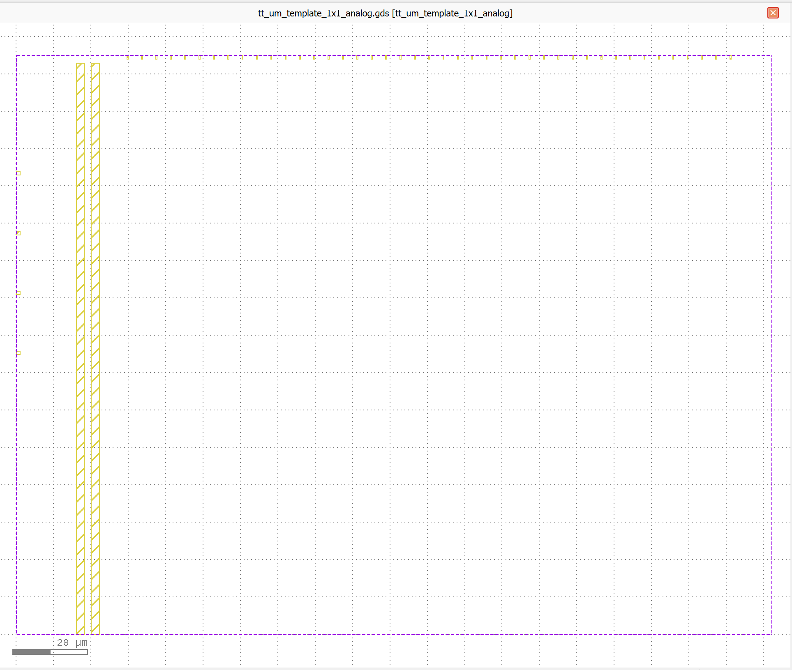

Click on the instance button:

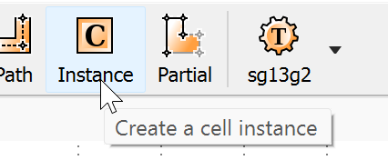

This will open an "Editor Options" pane. In **Library** select
"SG13_dev":

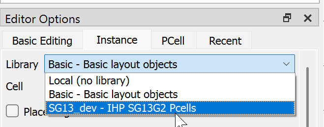

If you don't see this option, you either didn't clone the PDK repository
recursively, or are missing the psutil python package. You can find the
culprit by looking at the logs (File menu -> Log Viewer).

After selecting the library, click on the magnifying glass icon to find
the type of cell you'd like to instantiate:

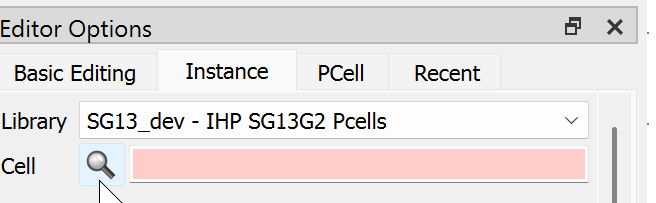

And select the cell type from the list:

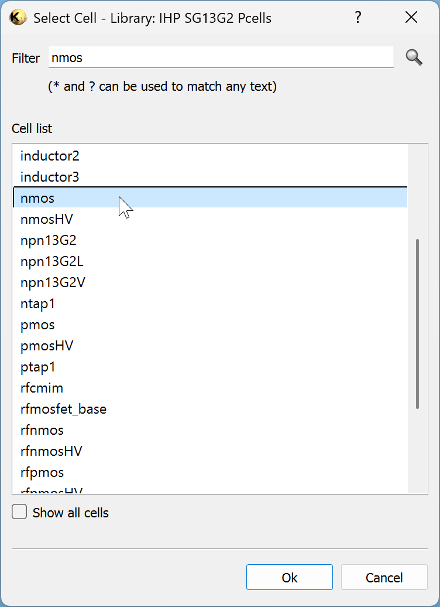

You can go to the PCell tab to change the parameters, e.g. gate length.
In the following example, I changed the length from the default "0.15u"
to "0.5u". After changing any of the parameters, click on the Update
button:

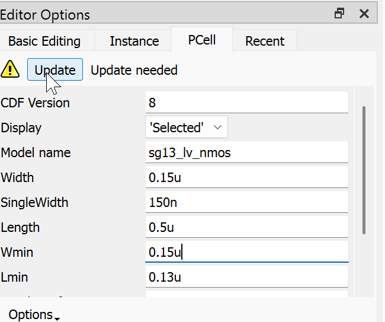

Then, place the cell in your design, by clicking where you want to place
it. You may need to zoom in to see the actual cell placeholder:

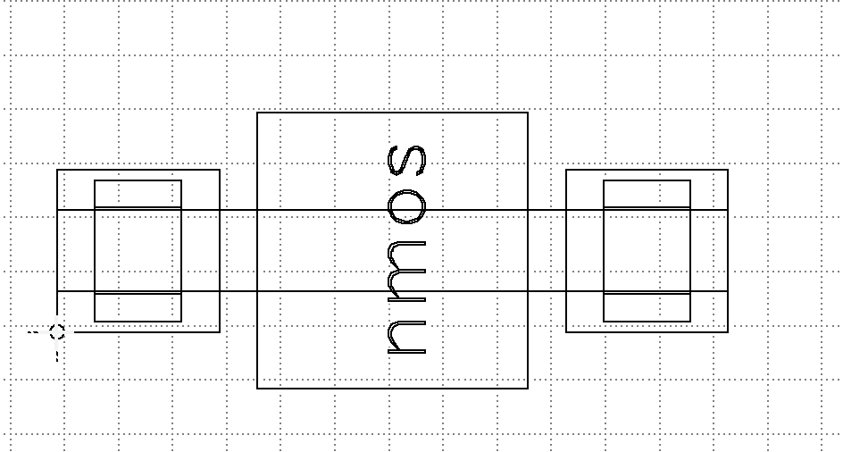

After placing the cell, you may just see an outline of the cell, e.g.:

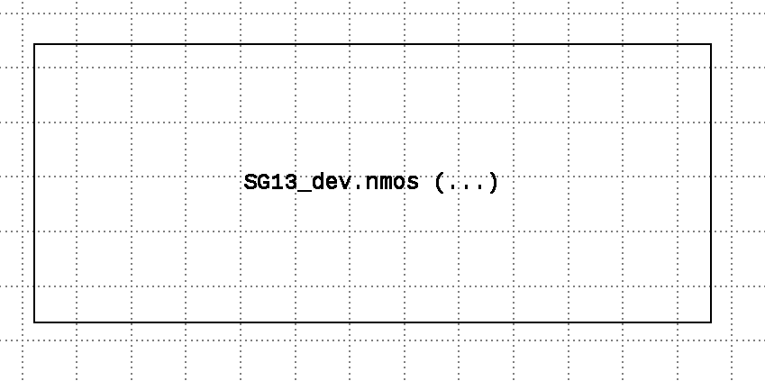

To see the actual content, set the Display mode to Full Hierarchy, by
either clicking the "Display" -> "Full Hierarchy" menu option, or the
pressing "\*".

The result should look as follows:

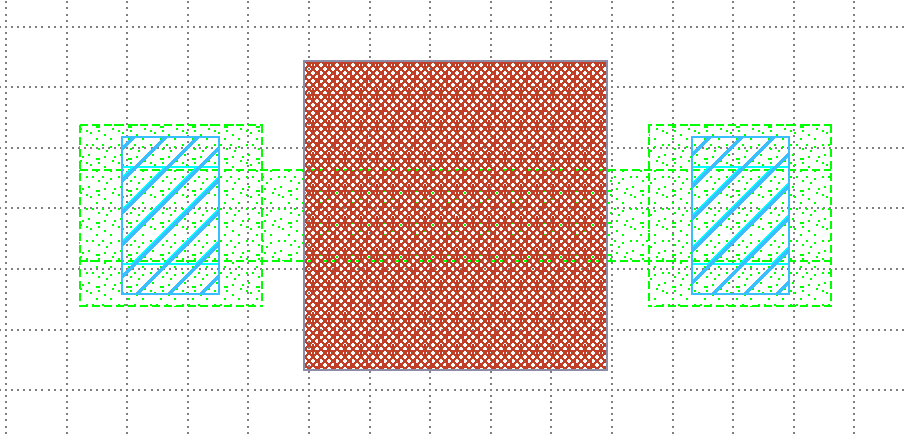

Changing PCell parameters
~~~~~~~~~~~~~~~~~~~~~~~~~

To change PCell instance parameters after you created it, select the
PCell and press **Q**, then go to the **PCell parameters**:

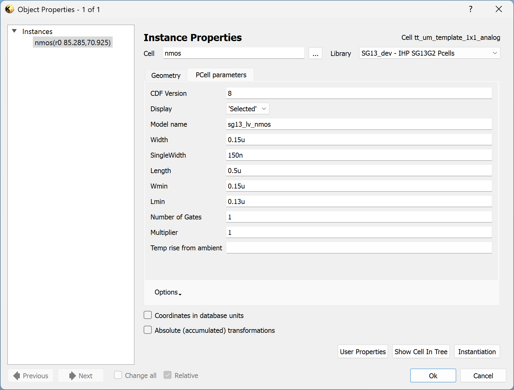

Routing Wires
-------------

To route wires, first, select the relevant layer (e.g.
**Metal2.drawing**), then use the Path tool to draw the wire:

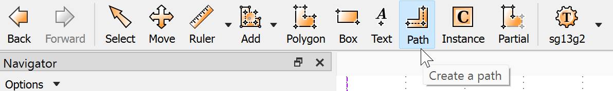

After clicking on the path button, you can set set width of the wire in
the **Editor Options** pane at the bottom, in the **Path** tab:

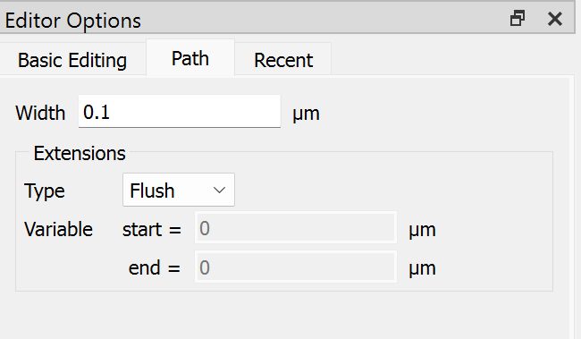

To make the path go in right angle, hold the Shift key while drawing it,
or set the **Connections** option to **Manhattan** in the **Basic
Editing** tab of the **Editor Options** pane:

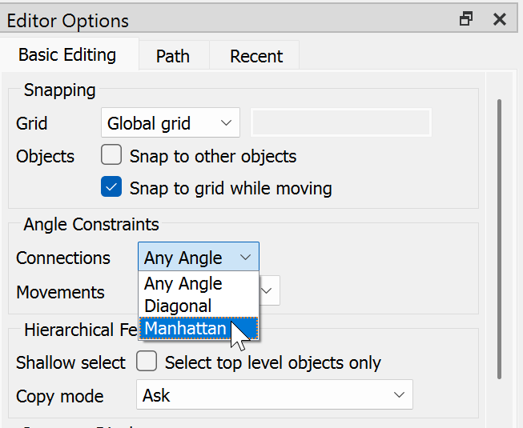

Paint the path with the left mouse button, double-click to end the path.

To draw a Via, select the relevant via layer (e.g. **Via2.Drawing** to
switch between Metal2 and Metal3), and then draw a box. Note that the
IHP SG13G2 DRC rules mandate 0.19 um width for metal vias. You can
specify the width of the via by double-clicking the box after drawing it
and setting the **Size (w/h)** values in the **Center/Size** tab:

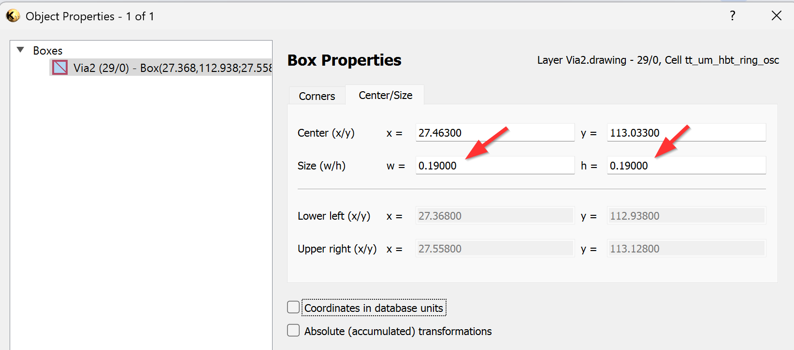

Alternatively, you can use the **via_stack** PCell (see the section
about Creating PCell Instances above), and specify the low/bottom layers
(as well as the number of rows/columns) in the PCell parameters:

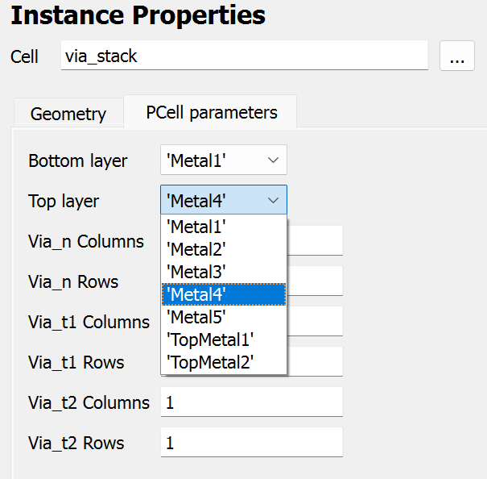

If you need to modify an existing path, you can use the **Partial** tool
edit to move a point, section, or several points on the path. Make sure
to click shift when moving the path section, to make sure the paths
remain straight.

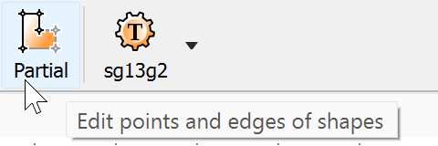

Using Standard Cells
--------------------

Importing the cells into your design
~~~~~~~~~~~~~~~~~~~~~~~~~~~~~~~~~~~~

To include standard cells in your design, open the
`sg13g2_stdcell.gds <http://sg13g2_stdcell.gds>`__ library (found under
libs.ref/sg13g2_stdcell/gds in the PDK) in another Klayout instance.

You will see a list of all the standard cells in the **Cells** pane on
the left. Middle click on a cell to see its content.

Right click on the cell that you want to add to your design, and choose
**Save Selected Cell As**, and save the selected cell as a GDS file.

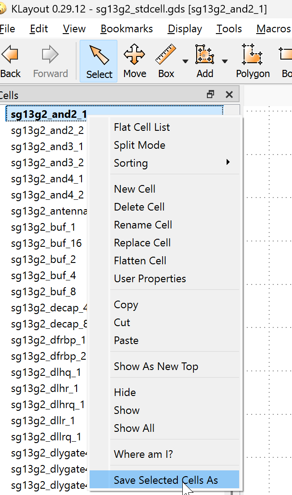

Then, go back to your design, and click on the **File** -> **Import** ->
**Other files into current**. Click the "..." in the **Input** pane and
select the GDS file you exported above. Under **Import Mode** select the
**Instantiate** option and click **Import.**

If you don't see the actual cell, and only see a box where the cell
should be, press "\*" to display the full hierarchy.

Placing the cells
~~~~~~~~~~~~~~~~~

When placing several cells next to each other, make sure the purple
border of the cells (the prBoundary.boundary) layer aligns horizontally,
and overlaps vertically.

Example of good placement of two sg13g2_and2_1 cells:

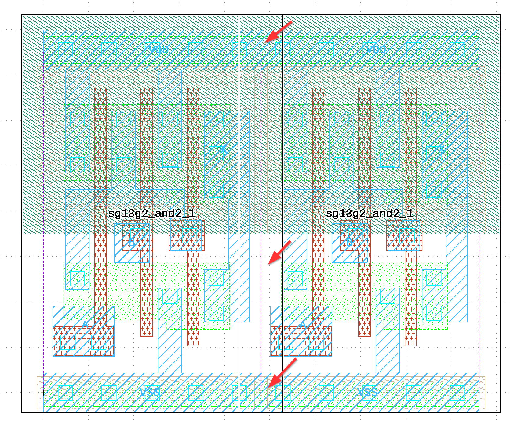

Bad placement (the dashed purple line doesn't align horizontally):

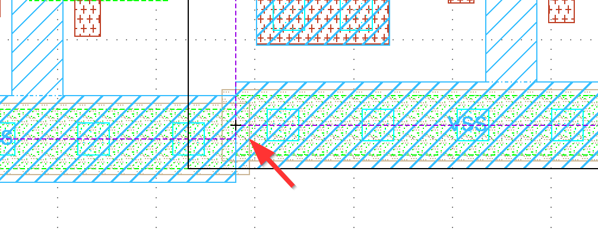

Bad placement (the dashed purple line doesn't overlap vertically):

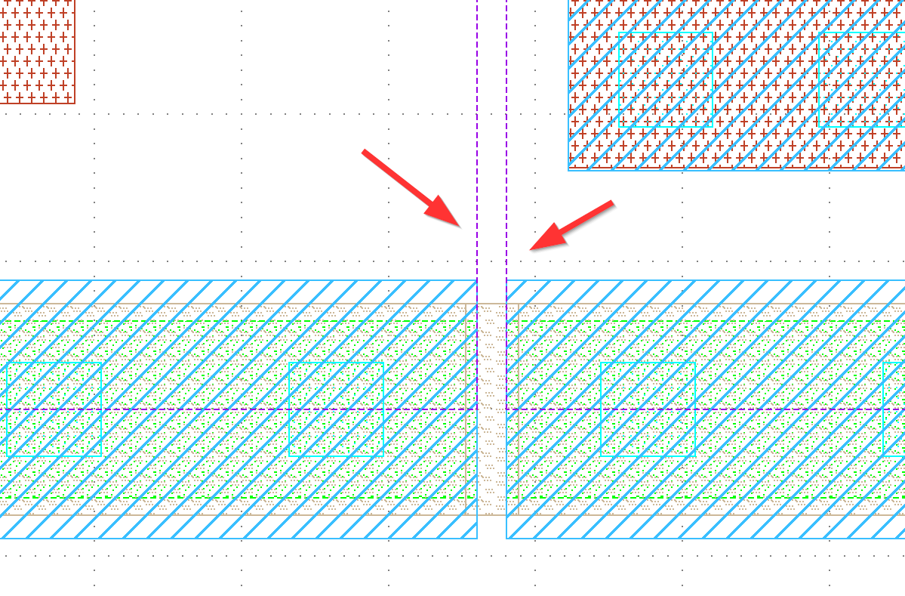

Running DRC checks
------------------

To run DRC checks, go to the **Tools** menu, select the **DRC** submenu,
and then you should see two DRC scripts: "sg13g2_minimal" and
"sg13g2_maximal". The full paths will differ, according to the PDK path
on your computer. For smaller designs, you'll want to run the
"sg13g2_maximal".

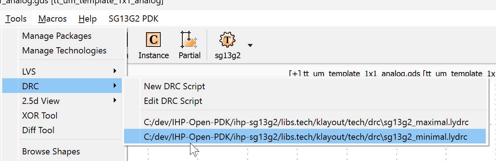

After running the DRC script, you'll get a DRC report with errors.

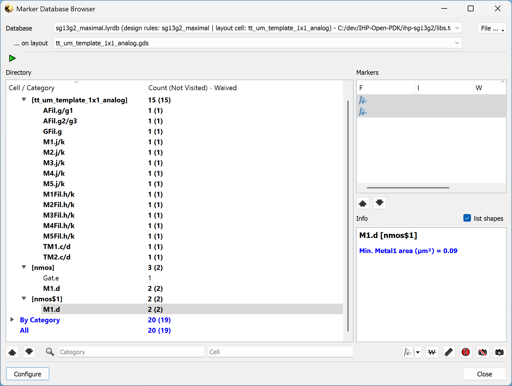

Click on a specific error to see the details (in the Info pane on the
right).

You can happily ignore any errors related to the fill or global metal
density (e.g. AFil.g\*, GFil.g, M\*.j/k, M*Fil.h/k, TM\*.c/d).

Exporting the GDS file for Tiny Tapeout
---------------------------------------

When exporting the GDS file for Tiny Tapeout, please uncheck the "Store
PCell and library context information (format specific)" box. Note that
this will make the PCells uneditable, so **do not** override your
original GDS - rather, save another GDS copy for the Tiny Tapeout
submission.

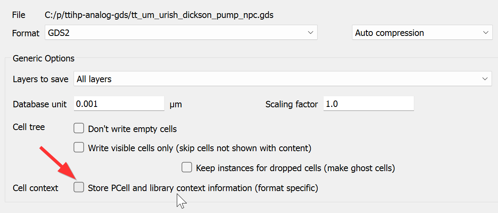
