Delete Zero-area Shapes 
=======================

2025/12/10

`Luighi Viton-Zorrilla <mailto:luighiavz@gmail.com>`__

| Analog/AI Track
| Chipathon 2025

Context
-------

After we sent to foundry it returned the GDS with some issues of vertex
like the following:

   ERROR: Degenerate (vertex count = 5) boundary at location
   (10.645,11.895) in cell bandgap_opamp$1$1 on layer 46 datatype 0.

That occurs because we have some shapes that have width or height equal
to zero. Normally, it should be merged to the adjacent polygon so it
doesn’t raise any DRC violation. However, it looks like in batch mode,
the geometries are not merged and it is raising those issues. So we need
to fix them.

Manual procedure
----------------

This is the most straight forward which uses the information obtained by
foundry and localize the problematic shape to delete it

   Thanks to the comments in the Chipathon Element by another track
   leader, Adrian Pratama\ adriansamisch@gmail.com\ He provided a tip to
   detect the problematic vertex which was selecting the area around it.
   I did it and found a strip of metal which had no width. So, it
   confirms that the issue doesn't come from the overlapped boxes but
   from a remaining polygon, on the edge, probably coming from an diff
   operation.

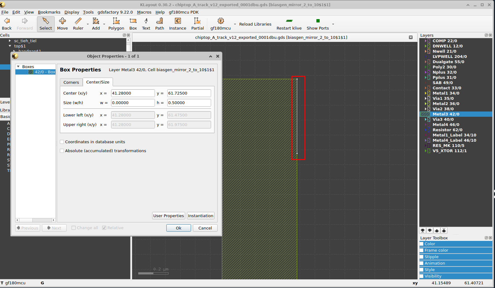

Semi-automatic procedure using Search and Replace tool
------------------------------------------------------

Although we can search one by one according to the violations raised by
foundry, that procedure is not practical to find all the zero width
geometries as they are not easily visible. So, KLayout has a tool called
Search and Replace which is perfect for this use case.

So, go to Edit→ Search and Replace:

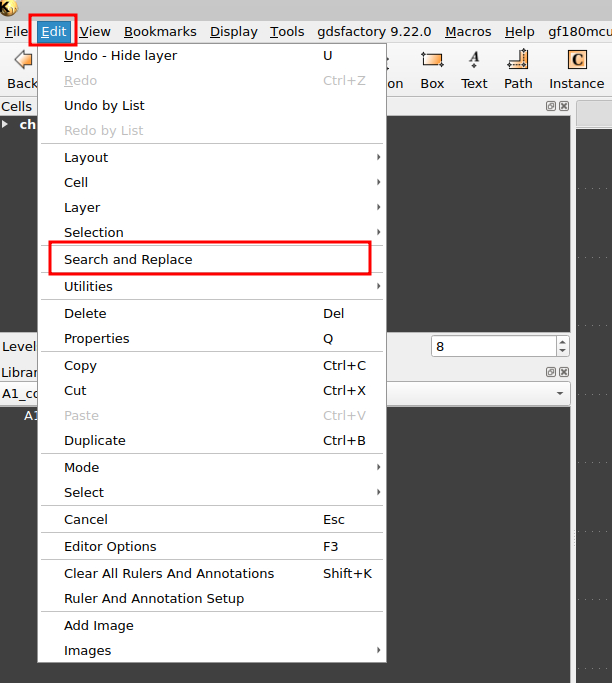

So, we can first go to the **Find** Tab to do some searches, however, as
we know we want to delete the shapes, we can jump to the **Delete** tab
and search on each of the layers (specially metal layers) for zero area
shapes. You can use the following configuration as example:

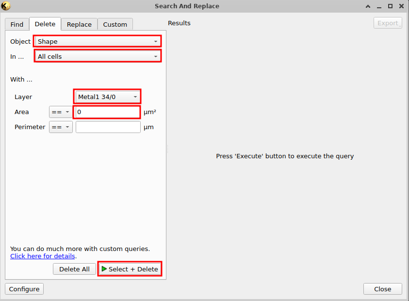

After we press the **Select+Delete** button, it will show the list of
shapes that are zero-area (either width or height are zero). There we
can select the shapes and they will be highlighted in the panel.

We just need to delete the boxes :mark:`(I think texts are not needed
but we will confirm after new submission).`

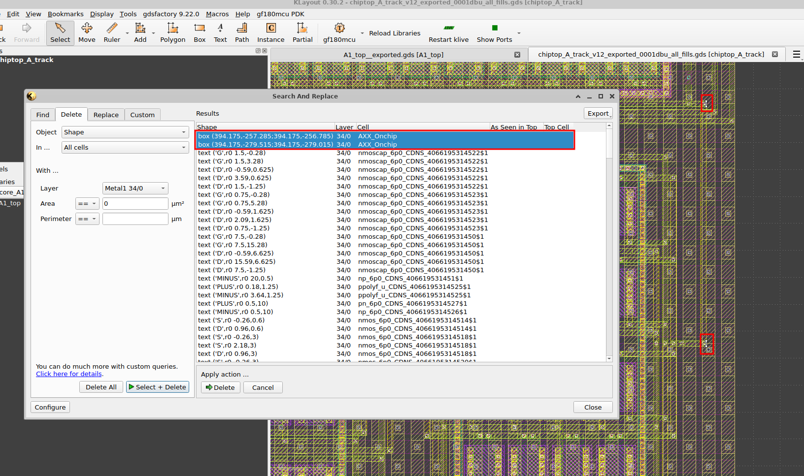

Then we can click on delete to delete the shapes. After that the
selected shapes will disappear from the list as well as the highlights
in the panel which means they are deleted.

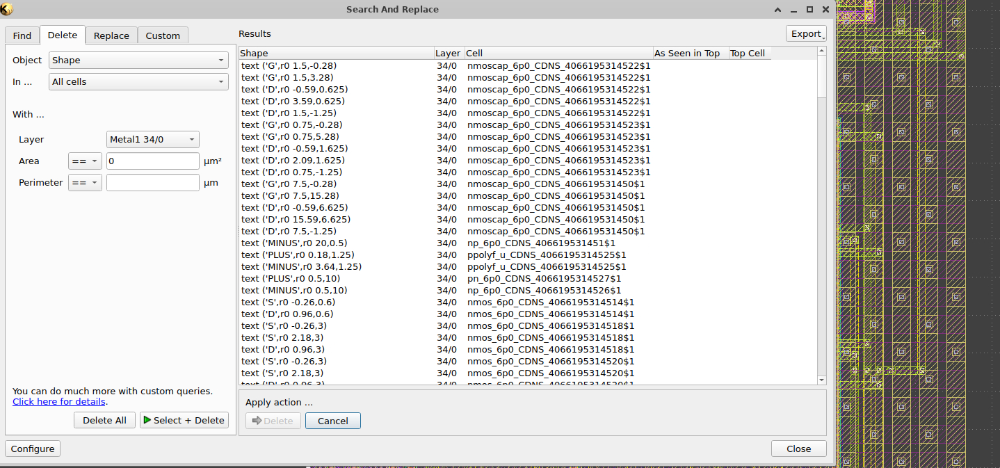

We need to repeat the same procedure for all the metals which are the
likely problematic layers. For example, for metal 2:

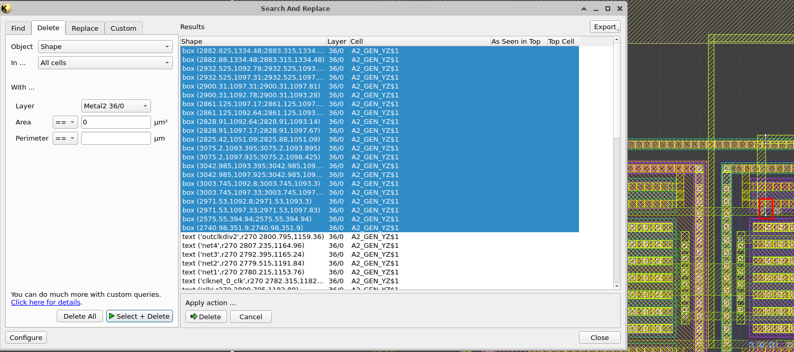

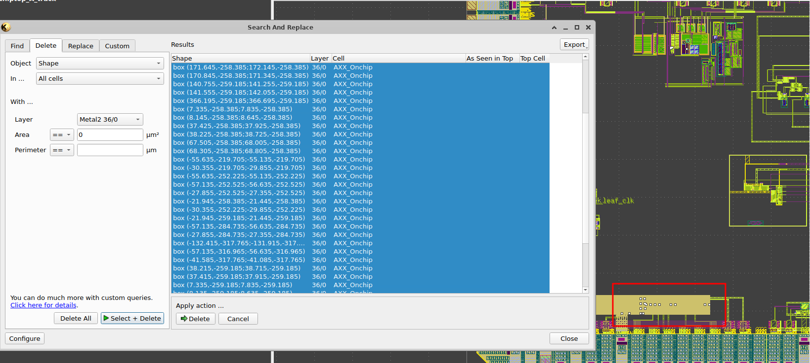

For metal 3:

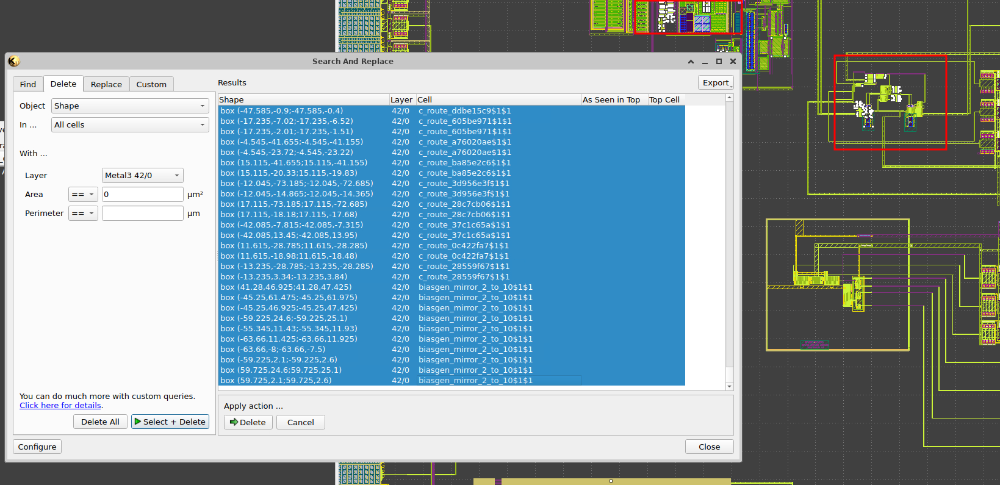

For metal 4, we could find the problematic shape that raised the warning
previously:

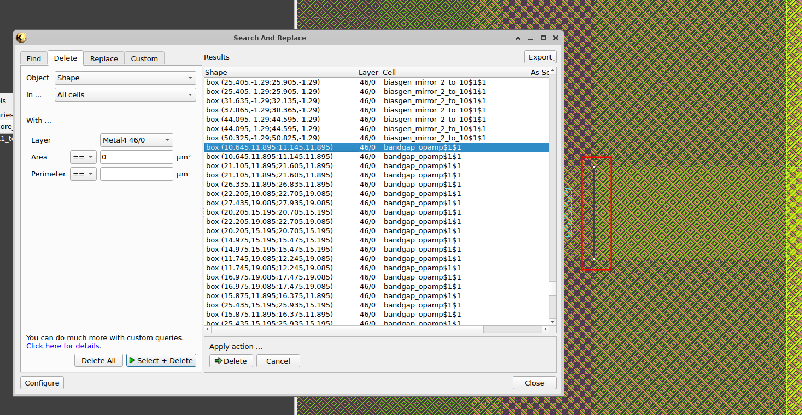

Now we can select all of them and just remove them

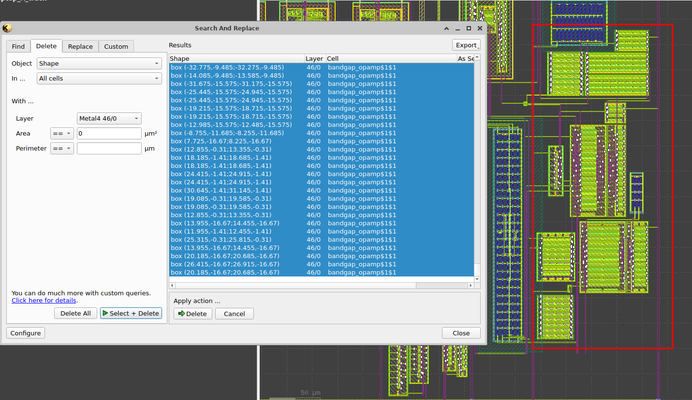

Note: interestingly the shapes there were generated using glayout, so we
might need to check the generators just to confirm if they are not
introducing those shapes.

Please, also check the diffusion layers, DNWELL, NWELL, NPLUS, PPLUS and
marker layers, Dualgate, etc. For example:

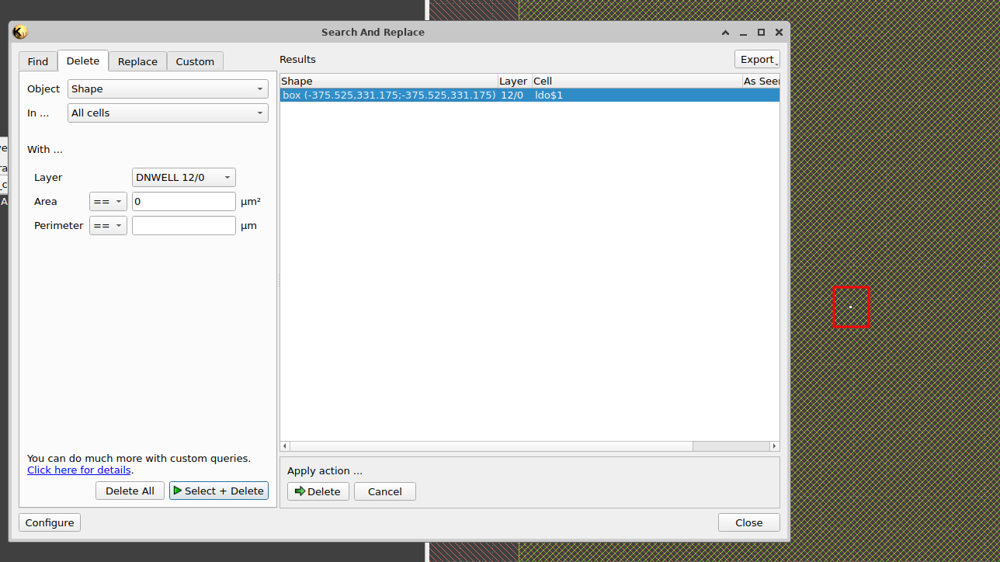

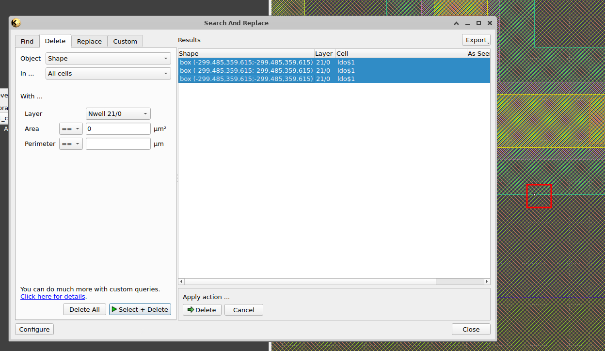

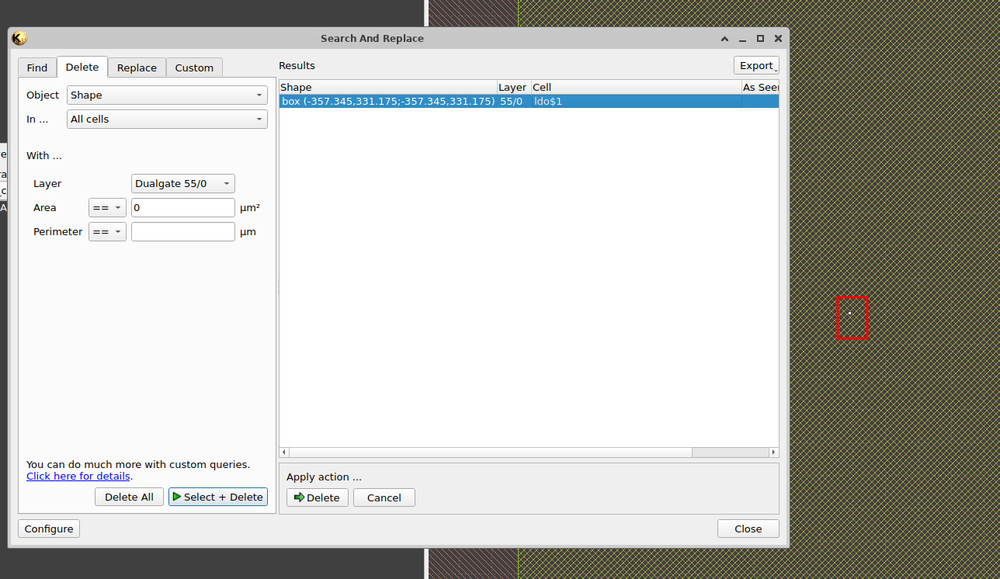

After we have covered all the layers we can recheck if there is still
zero-area shapes again, running again the tool on each layer, and it
should look empty after searching them:

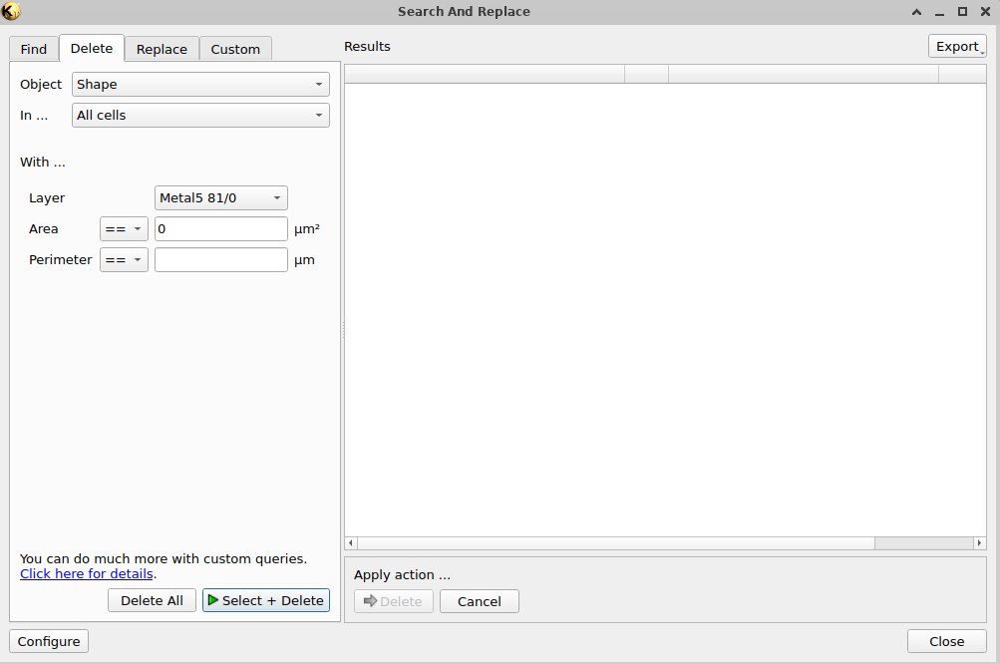

Once we confirm everything is OK, we can save the file and send it again
for verification in the foundry or using commercial DRC tool in batch
mode.

Automatic procedure using script (to-do)
----------------------------------------

Although checking the geometries is good to select which want to
preserve and the others to delete, in this case, we know that for boxes
or polygons shouldn’t exist those zero-area geometries. So, we can prune
them programmatically.

:mark:`This is in the to-do list as right now I don't have the bandwidth
to develop it.`
