Met-Fill GF180
==================================

2025/09/29

`Luighi Viton-Zorrilla <mailto:luighiavz@gmail.com>`__

| Analog/AI Track
| Chipathon 2025

`Context 1 <#context>`__

`Preliminary steps 1 <#preliminary-steps>`__

   `Check the Design Reference Manual (DRM)
   1 <#check-the-design-reference-manual-drm>`__

`Procedure to fill metal 2 <#procedure-to-fill-metal>`__

   `1. Create a base cell using the guidelines from DRM
   2 <#create-a-base-cell-using-the-guidelines-from-drm>`__

   `2. Place the cell into the design
   3 <#place-the-cell-into-the-design>`__

   `3. Open the fill tool and configure accordingly
   3 <#open-the-fill-tool-and-configure-accordingly>`__

   `4. Run the density check 6 <#run-the-density-check>`__

   `5. Send for verification to commercial tools
   7 <#send-for-verification-to-commercial-tools>`__

`Procedure to fill poly + comp (WIP)
8 <#procedure-to-fill-poly-comp-wip>`__

   `1. Create a base cell using the guidelines from DRM
   8 <#create-a-base-cell-using-the-guidelines-from-drm-1>`__

   `2. Place the cell into the design
   8 <#place-the-cell-into-the-design-1>`__

   `3. Open the fill tool and configure accordingly
   8 <#open-the-fill-tool-and-configure-accordingly-1>`__

   `4. Run the density check 11 <#run-the-density-check-1>`__

   `5. Send for verification to commercial tools
   11 <#send-for-verification-to-commercial-tools-1>`__

Context 
-------

When running the DRC checks it is usual that after solving most of the
errors it is pending the density violations.

So we will need to fill empty areas with metals, poly or comp to
accomplish those rules.

There are several approaches to do that. We can do it manually (we have
tried this first with jsmoya07@gmail.com. However, it is flexible but
not very practical when having several regions that have no regular
shapes, and prone to rework several times.

Then using scripts for an automatic or semi-automatic way is preferred.
In this case, we will use the Fill tool available in KLayout. This
procedure was initially shown by amro_tork@mabrains.com

Preliminary steps
-------

Check the Design Reference Manual (DRM)
~~~~~~~~~~~~~~~~~~~~~~~~~~~~~~~~~~~~~~~

As general recommendation from amro_tork@mabrains.com always check the
DRM. There are several rules for the metal filling, poly filling and
comp filling.

`13.1 Design rules for Dummy COMP
creation <https://gf180mcu-pdk.readthedocs.io/en/latest/physical_verification/design_manual/drm_13_1.html>`__

`13.2 Design rules for Dummy Poly2
addition <https://gf180mcu-pdk.readthedocs.io/en/latest/physical_verification/design_manual/drm_13_2.html>`__

`13.3 Design rules for Dummy Metal
addition <https://gf180mcu-pdk.readthedocs.io/en/latest/physical_verification/design_manual/drm_13_3.html>`__

**Note:**

Thanks to Royce Richmond (miles-militis@hotmail.com) that identified
several constraints in the DRM which we with jsmoya07@gmail.com didn’t
see at first glance and generated several issues in our first trial
using the manual approach. That’s why we ended up moving to this
semi-automatic way.

Procedure to fill metal
-----------------------

Create a base cell using the guidelines from DRM
~~~~~~~~~~~~~~~~~~~~~~~~~~~~~~~~~~~~~~~~~~~~~~~~

Regarding this point the DRM has several rules for the metal filling,
but maybe the most important are the size for the fillings which is
2umx2um and the offset between adjacent layers that must be 0.5 and 0.5:

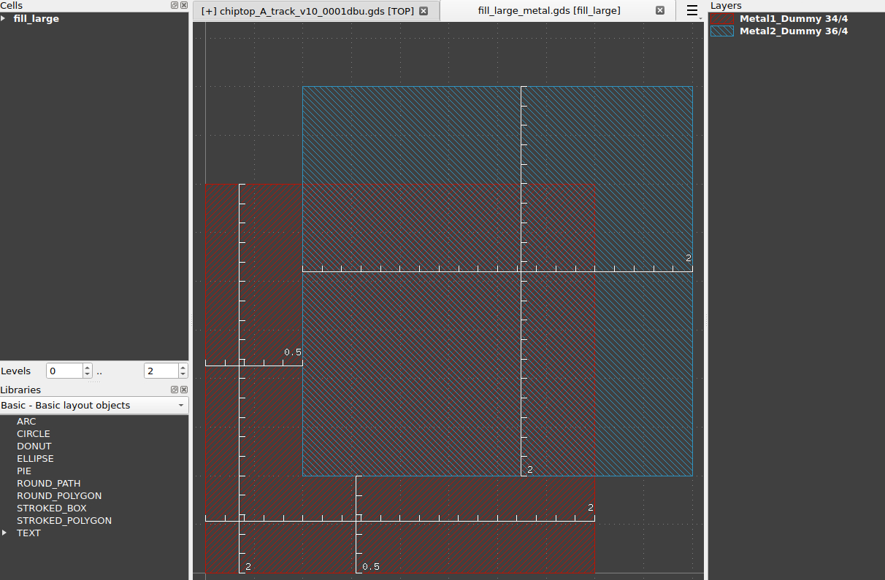

Can download from here:
`fill_large_metal.gds <https://drive.google.com/file/d/1oZdEmnh9mqETDT4oB6nTz4vGvkwie3uh/view?usp=sharing>`__

Place the cell into the design
-------

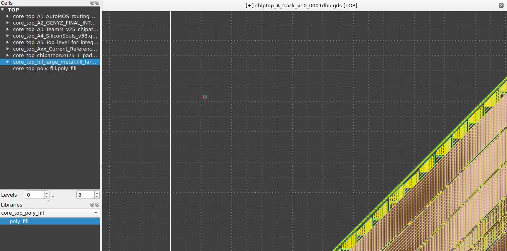

We can place it anywhere, however, it might be preferable in a corner,
so later we can delete it.

Open the fill tool and configure accordingly
-------

a. Go to Edit → Utilites → Fill Tool

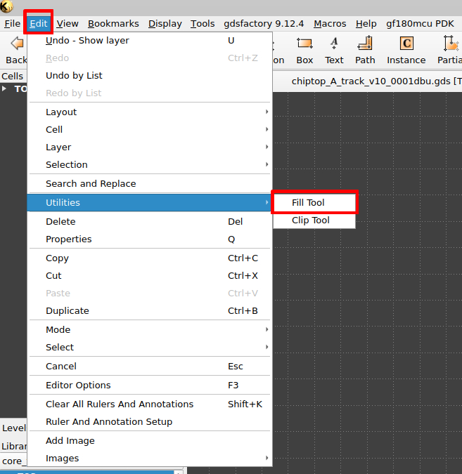

b. In Fill Area, we can select the Single box option and then specify
      the area inside padring that will be filled. You can use the
      values below as reference. In the spacing can use 20u.

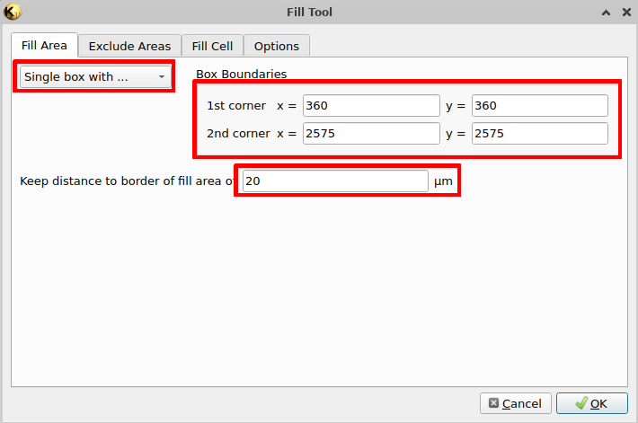

c. In Exclude Areas, can select the option All Visible Areas, and in the
      layers panel select the metal and diffusion layers, which are
      likely to enclose all other active elements.

..

   We can select vias as well however it would take more time and the
   result might be similar as the vias are expected to be enclosed by
   metal. For the distance use 6um.

|image1|\ |image2|

d. In the fill cell tab, we will need to select the cell we already
      placed in the design from the list of available clicking on the …
      button.

|image3|\ |image4|

Then we can select the boundary layer, which will be used as reference
to create the pattern. In this case we use the layer at the bottom in
our cell (Metal1_Dummy)

Finally, we select the spacing between rows and columns, which according
to DRM must be 1.6um. However, we increased to the double and chosen
3.2um

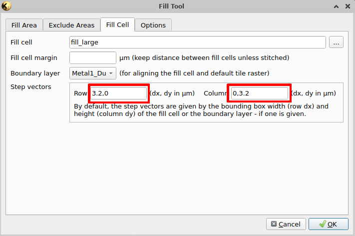

e. In Options there is a possibility of adding a secondary cell for
      filling, however according to the DRM this technology only uses a
      fixed size for the filling. So we don’t need to select anything
      there and just click on OK

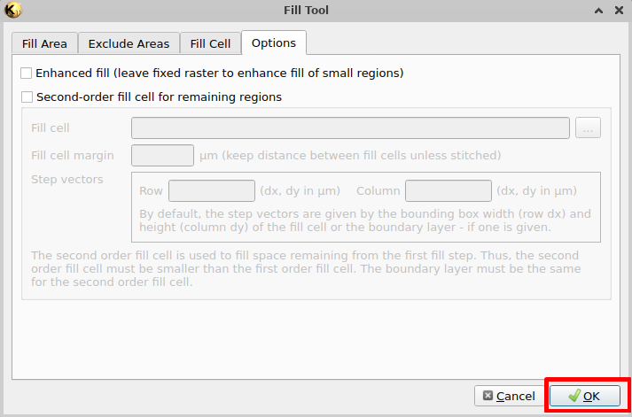

**Recommendations:**

When running the tool for metal is recommended to have RAM memory
available, otherwise it might freeze your computer and even crash
KLayout, so please be careful, and also save your layout before running.

After the process finishes, the result should be similar to: |image5|

Run the density check
-------

We might need to use the latest version from the tool that was delivered
by amro_tork@mabrains.com:

git clone
https://github.com/mabrains/globalfoundries-pdk-libs-gf180mcu_fd_pv.git

cd globalfoundries-pdk-libs-gf180mcu_fd_pv/klayout/drc

After that we can run the following command:

python3 run_drc.py
--path=/foss/designs/libs/core_top/chiptop/chiptop_A_track_v10_0001dbu.gds
--variant=D --density_only --thr=8
--run_dir=/foss/designs/libs/core_top/chiptop/metal2

Replace the path option by the actual path for your GDS and the run dir
option by a writable location in your environment, i.e. a folder inside
designs one.

Load into the KLayout by Tools → Marker Browser:

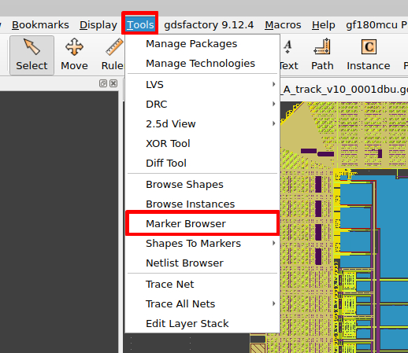

Click on File to select your file:

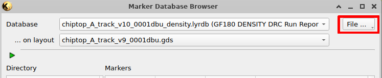

After this we can see that all the metal related density issues are
gone.

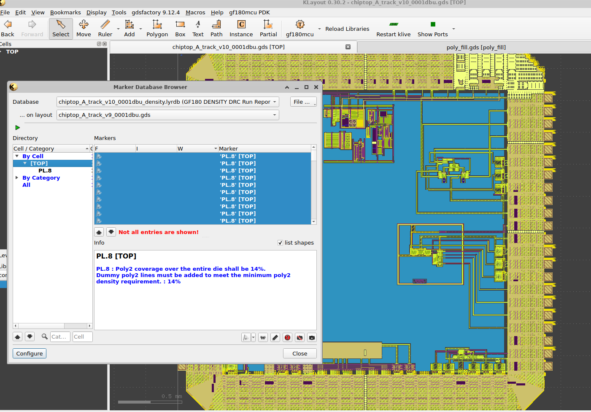

Send for verification to commercial tools
-------

We will need to run with commercial tools because the rules are not
implemented in KLayout yet. For this step, `Anhang
Li <mailto:anhangli@umich.edu>`__ is helping us.

Procedure to fill poly + comp (WIP)
-----------------------------------

.. _create-a-base-cell-using-the-guidelines-from-drm-1:

Create a base cell using the guidelines from DRM
-------

The design manual has several rules, however, some of the most relevant
are that the COMP size is 5.6umx5.6um and on top of it we can have the
poly dummy which must be a size of 5umx5um

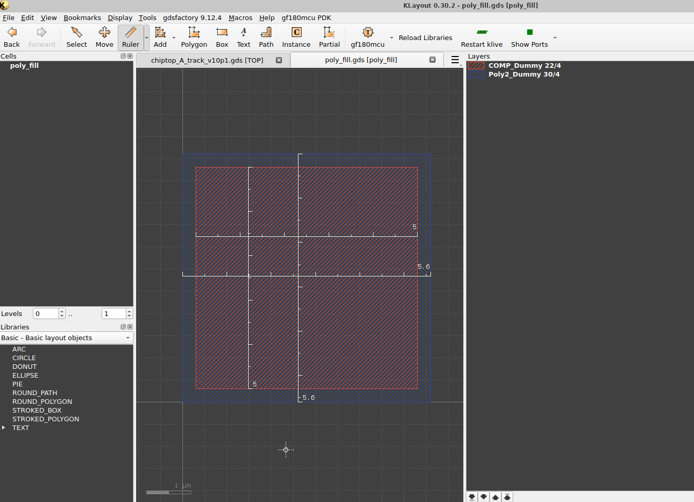

Can download from here:
`poly_fill.gds <https://drive.google.com/file/d/1IPFO-nKV0bx-XYl3ePG1-9vTrZ97bwho/view?usp=sharing>`__

.. _place-the-cell-into-the-design-1:

Place the cell into the design
-------

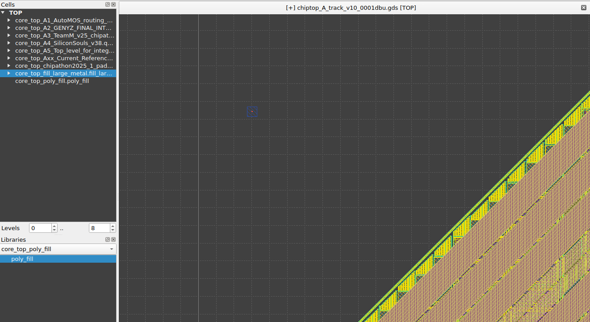

.. _open-the-fill-tool-and-configure-accordingly-1:

Open the fill tool and configure accordingly
-------

In this case we can reuse several of the values we have applied in metal
filling. The difference might be the distance to border fill, in this
case to be 8um.

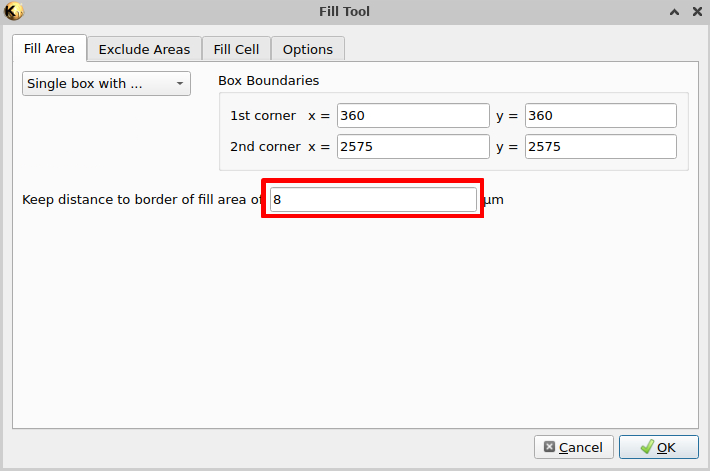

Also in the spacing around the excluding area might be 8um as well.

|image6|\ |image7|

We may only need to make visible the diffusion, comp, and hide all the
metals, as in this case we don’t have the risk of creating shorts with
them.

In the excluding areas we need to be careful because different layers
have different spacing requirements like RES_MK. So one strategy might
be covering those areas that have special requirements for spacing with
a blocking layer (PMNDMY) extending its area. So it can apply the same
spacing rule for all of the structures.

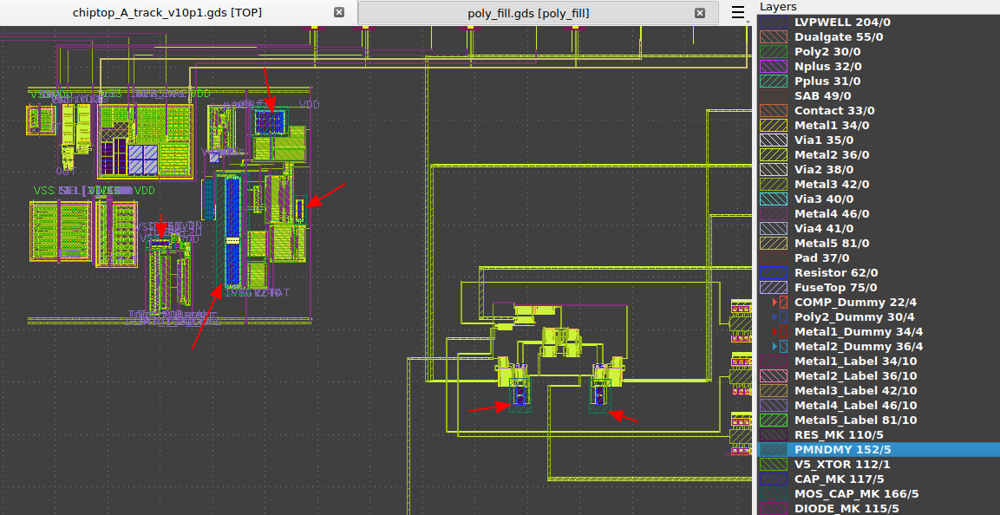

In the case of the fill cell we can use the fill_poly we have placed
into the design and select Poly2_Dummy as the reference for the
alignment.

In the case of step vectors, DRM says we can do a stagger generation in
both directions using 1.6um as distance. We expressed that using the
1.6u in the other vector component that for metal was 0.

Finally in the options tab we can keep the defaults one (not use
secondary) and click on OK.

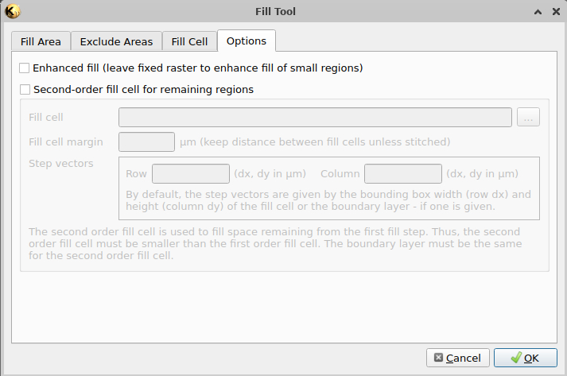

This filling might take less time as the previous one.

The result might be similar to the following:

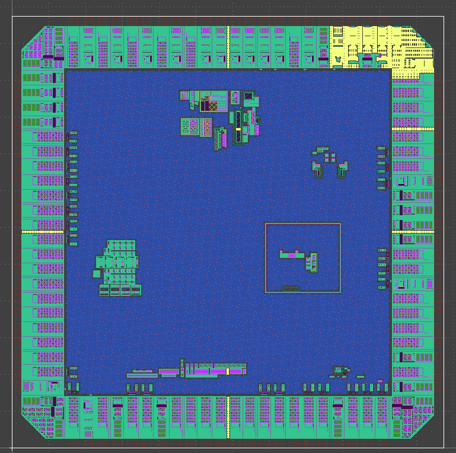

.. _run-the-density-check-1:

Run the density check
-------

We can reuse the same command as previously:

python3 run_drc.py
--path=/foss/designs/libs/core_top/chiptop/chiptop_A_track_v10_0001dbu.gds
--variant=D --density_only --thr=8
--run_dir=/foss/designs/libs/core_top/chiptop/metal2

However, in this case, we didn’t manage to get zero violations for
Poly2.

.. _send-for-verification-to-commercial-tools-1:

Send for verification to commercial tools
-------

Right now the only way we have to check if that worked or not is using
commercial tools.

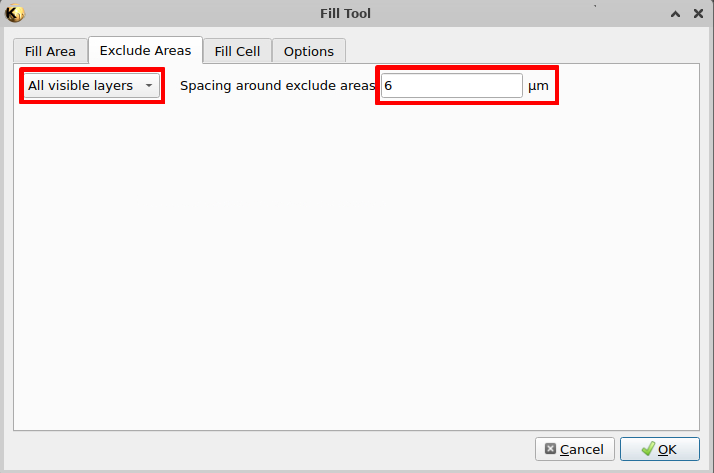
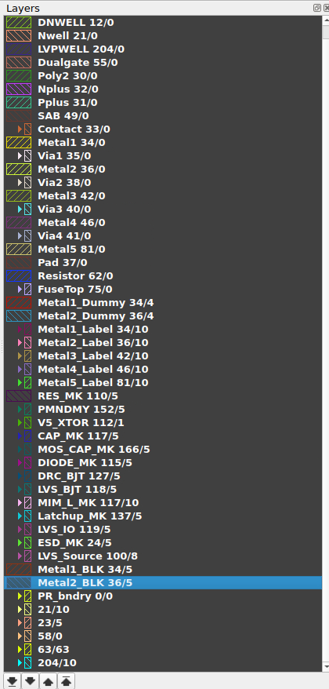
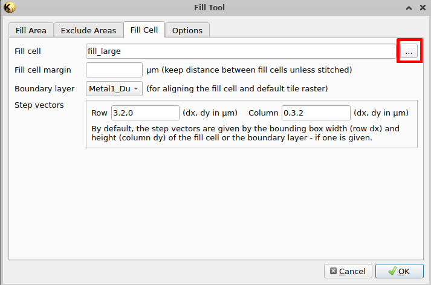
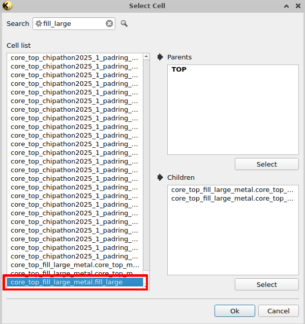
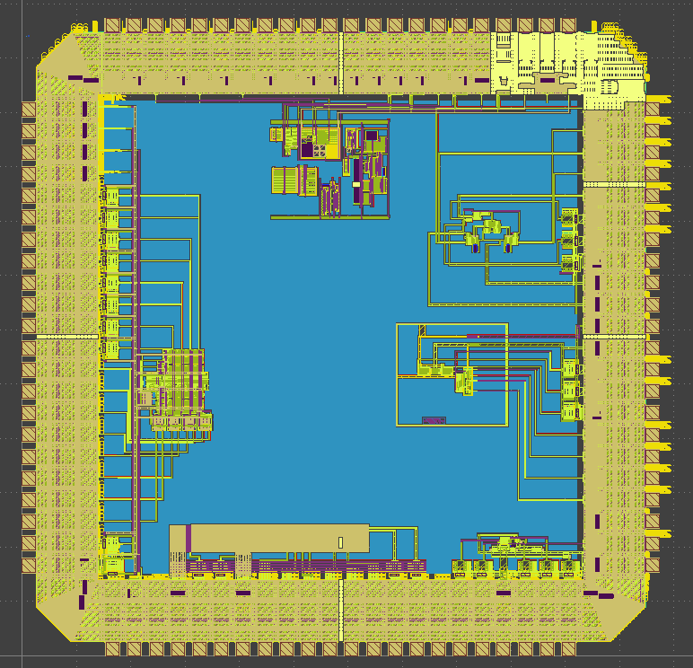
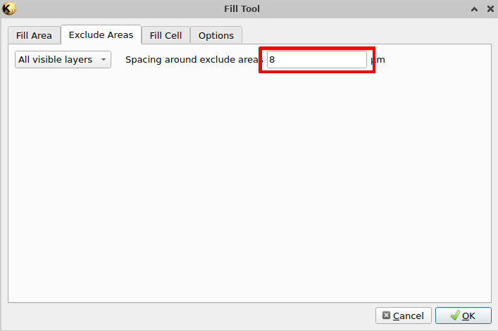
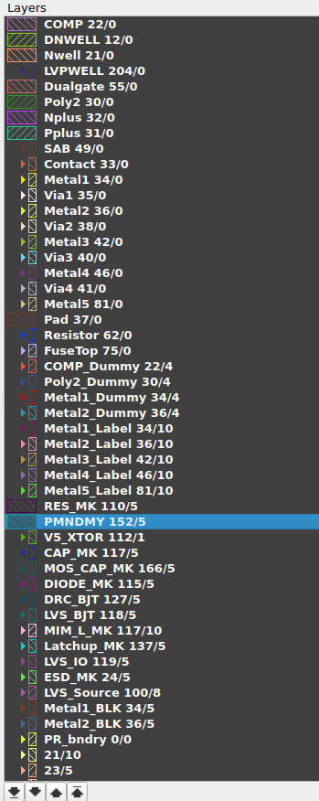
