Top Integration 
===============

(Juan Sebastián Moya-Baquero, Akira Tsuchiya)

To be answered (questions from Element chat):

-  **How many pins are available?**

   ..

      **What area is available inside the pad ring for circuits**

      **Can pins be configured as analog or digital by the designer, or
      are they pre-configured**

   ..

      **What is the schematic (roughly) of the analog pin and the
      digital pin?**

The
`padring <https://github.com/idea-fasoc/openfasoc-tapeouts/tree/main/gf180mcu_padframe>`__
to be used during the tapeout phase was provided by Mehdi Saligane’s
research group and is based on `I/O
cells <https://github.com/google/globalfoundries-pdk-libs-gf180mcu_fd_io/tree/main/cells>`__
designed by GlobalFoundries (GF) for their `gf180mcu
PDK <https://gf180mcu-pdk.readthedocs.io/en/latest/IPs/IO/gf180mcu_fd_io/datasheet.html>`__.

Below is a list of the `I/O
cells <https://gf180mcu-pdk.readthedocs.io/en/latest/IPs/IO/gf180mcu_fd_io/datasheet.html>`__
categorised by functionality:

+------------+---------------------------------+-----------------------+
|            | Cell type                       | Cell name             |
+============+=================================+=======================+
| Digital    | Bidirectional                   | gf180mcu_fd_io\__bi_t |
| pins       |                                 |                       |
|            |                                 | gf                    |
|            |                                 | 180mcu_fd_io\__bi_24t |
+------------+---------------------------------+-----------------------+
|            | Input                           | gf180mcu_fd_io\__in_c |
|            |                                 |                       |
|            |                                 | gf180mcu_fd_io\__in_s |
+------------+---------------------------------+-----------------------+
| Analog     | Analog                          | gf18                  |
| pins       |                                 | 0mcu_fd_io\__asig_5p0 |
+------------+---------------------------------+-----------------------+
| Power pins | Power Supply                    | gf180mcu_fd_io\__dvdd |
|            |                                 |                       |
|            |                                 | gf180mcu_fd_io\__dvss |
+------------+---------------------------------+-----------------------+
| Additional | Corner                          | gf180mcu_fd_io\__cor  |
| pins       |                                 |                       |
+------------+---------------------------------+-----------------------+
|            | Filler                          | gf                    |
|            |                                 | 180mcu_fd_io\__fillnc |
|            |                                 |                       |
|            |                                 | g                     |
|            |                                 | f180mcu_fd_io\__fill1 |
|            |                                 |                       |
|            |                                 | g                     |
|            |                                 | f180mcu_fd_io\__fill5 |
|            |                                 |                       |
|            |                                 | gf                    |
|            |                                 | 180mcu_fd_io\__fill10 |
+------------+---------------------------------+-----------------------+
|            | Breaker                         | gf180mcu_fd_io\__brk2 |
|            |                                 |                       |
|            |                                 | gf180mcu_fd_io\__brk5 |
+------------+---------------------------------+-----------------------+

Figure 1 shows the pad ring and the different I/O cells. The pad ring
has a total area of 2.935 µm x 2.935 µm and has 22 pins on each side,
giving a total of 88 pins.

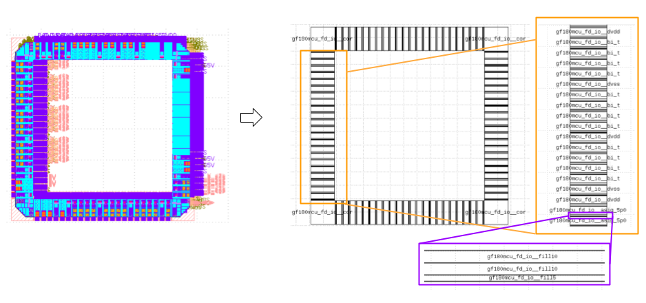

Figure 1: Padring and input/output cells integrated into it.

It is important to note that the pin distribution will vary depending on
the integrated projects, as demonstrated by the three projects submitted
for the 2023 Chipathon.

-  `LTC1 <https://github.com/Azeem-Abbas/DC23-LTC1/tree/main>`__

-  `LTC2 <https://github.com/akiles-esta-usado/DC23-LTC2/tree/f6358b6aff1b4526a014195b640335f1def6f0c5/padframe>`__

-  `LTC3
      (Bracolin) <https://github.com/gabrielmaranhao/Bracolin/tree/main>`__

The images below show the different types of pin connection used in the
Bracolin design.

-  gf180mcu_fd_io\__dvdd

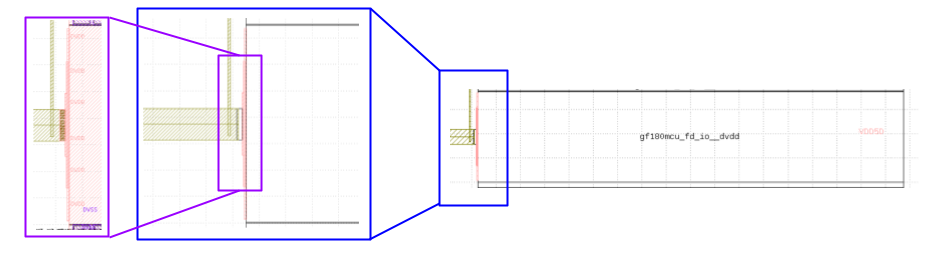

-  gf180mcu_fd_io\__dvss

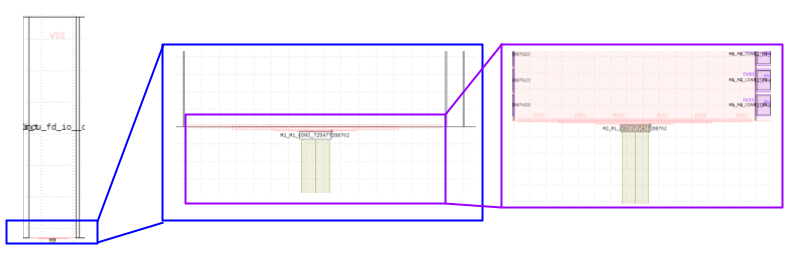

-  gf180mcu_fd_io\__asig_5p0 (analog inputs)

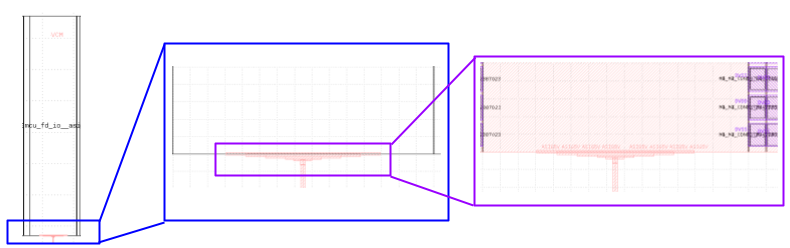

*Important information:* CDM protection network may be added to 5V
analog signal pad as indicated in `GF
documentation <https://gf180mcu-pdk.readthedocs.io/en/latest/IPs/IO/gf180mcu_fd_io/analog.html>`__.

When integrating the digital pins into the pad ring, designers must
configure their functionality correctly to ensure adequate performance,
based on GF’s documentation `Digital I/O Cell Control
Pins. <https://gf180mcu-pdk.readthedocs.io/en/latest/IPs/IO/gf180mcu_fd_io/digital.html>`__

-  gf180mcu_fd_io\__bi_t (bidirectional pin)

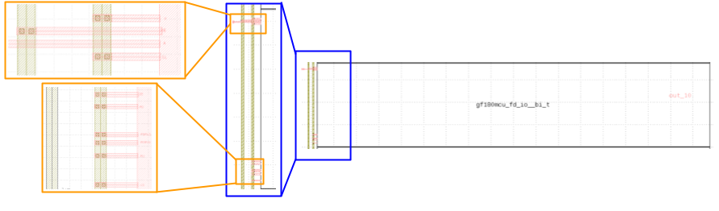

Detailed Connection of Digital I/O cell control pins for output
configuration.

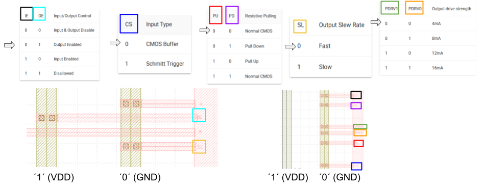

For this special case (output), the configuration used is:

+-----------------------------------+----------------------------------+
| Pin                               | Connection                       |
+===================================+==================================+
| IE                                | ‘0’                              |
+-----------------------------------+----------------------------------+
| OE                                | ‘1’                              |
+-----------------------------------+----------------------------------+
| CS                                | ‘0’                              |
+-----------------------------------+----------------------------------+
| PU                                | ‘0’                              |
+-----------------------------------+----------------------------------+
| PD                                | ‘0’                              |
+-----------------------------------+----------------------------------+
| SL                                | ‘0’                              |
+-----------------------------------+----------------------------------+
| PDRV0                             | ‘0’                              |
+-----------------------------------+----------------------------------+
| PDRV1                             | ‘0’                              |
+-----------------------------------+----------------------------------+

For this configuration example, we selected a 4mA output driving
strength (PDRV0 = PDRV1 = ‘0’), but this can be changed based on design
requirements.

Next step is to configure the `driver for output
signal <https://gf180mcu-pdk.readthedocs.io/en/latest/IPs/IO/gf180mcu_fd_io/tri_state_1.html>`__:

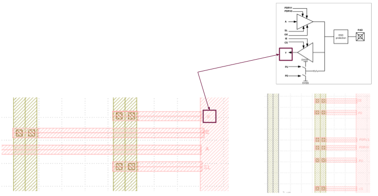

In the figure above, the input driver is disabled since ‘A’ signal is
the output coming from the circuit designed.

As indicated above, it is necessary to connect the different signals to
‘1’ (VDD) or ‘0’ (GND) for configuring the pins. Those signals are
generated using the next two cells, as indicated in the figure below:

-  gf180mcu_fd_sc_mcu7t5v0_tieh

-  gf180mcu_fd_sc_mcu7t5v0_filltie

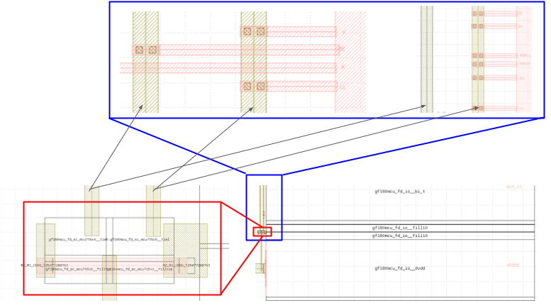

Finally, if the building blocks are designed to generate or use currents
that pass through the I/O cells, ESD leakage currents must be taken into
account. Some of the building blocks included in the Bracolin die had no
ESD cells (a customized cell with no ESD protection was designed) due to
leakage in the ESD protection. The leakage current of the ESD protection
was too high for the design (~ 200pA).

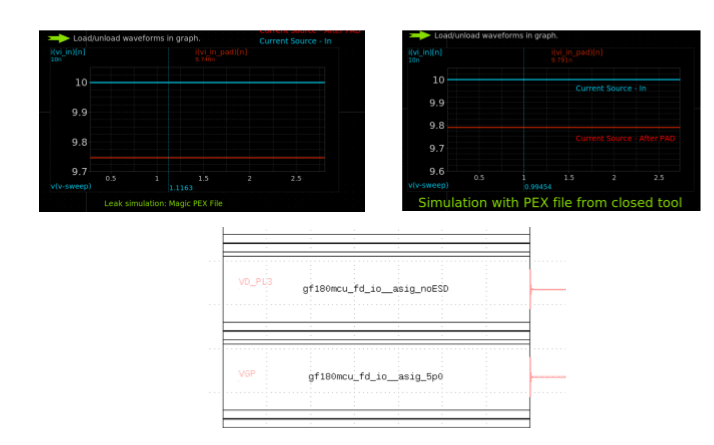

During the final DRC verification of the 3 projects, new DRC rules
appeared when running DRC flow with the *gf180 commercial PDK*.
Especially for circuits close to the I/O pads. As it was also identified
in `this
presentation <https://docs.google.com/presentation/d/12w4WBoleFAE4UePdoUf-bxsZR_BttwY3wknBPPJrEHE/edit?usp=sharing>`__
provided by Mehdi’s research group (slides 13 and 14).

Here are the lists of the DRC errors for each of the 2023 Chipathon dies
that we were able to waive:

-  *LTC1 design*

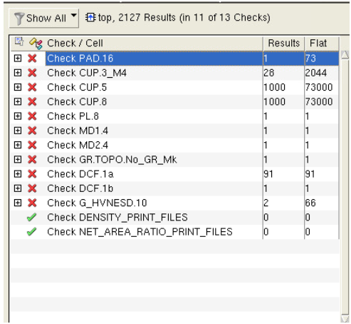

-  *LTC2 design*

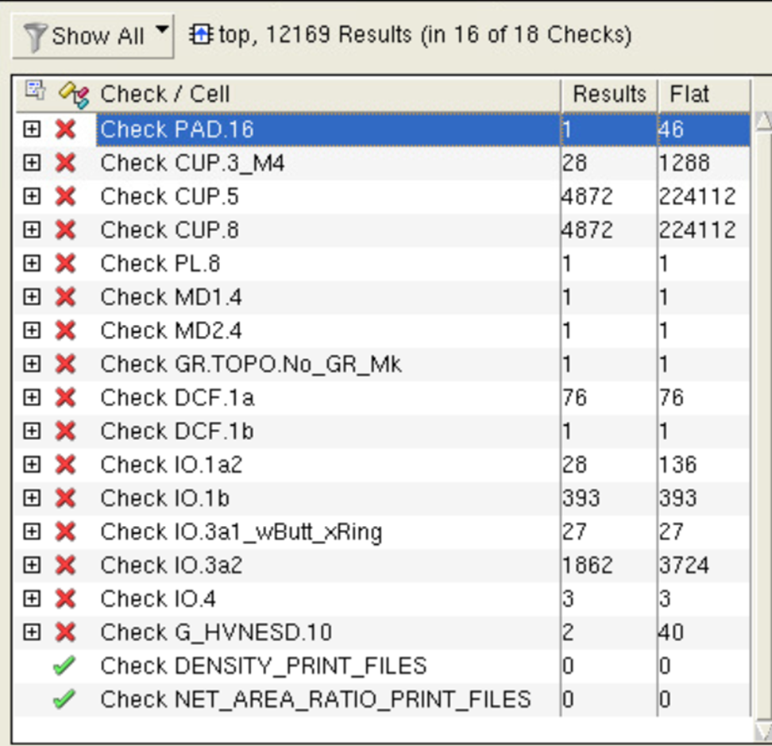

-  *LTC3 design*

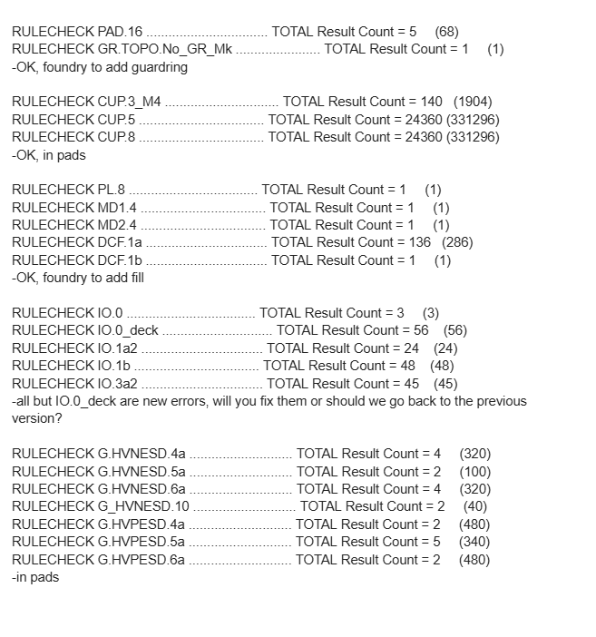
