*******
klayout
*******

LVS
===

Install netgen:
^^^^^^^^^^^^^^^

cd into the dir you clone all your OS tools into and type the following
command:

git clone git://opencircuitdesign.com/netgen netgen

cd netgen

./configure

make

make install

netgen --version

Ensure version 1.5 is installed as this is the latest. Total compile
time is in mins.

Useful links:

http://opencircuitdesign.com/netgen/index.html

https://web02.gonzaga.edu/faculty/talarico/vlsi/netgen.html

Generate netlist:
^^^^^^^^^^^^^^^^^

In xschem, descend into the sub-block you are LVS’ing against.

Go to simulation/LVS and select “LVS netlist + Top level is a .subckt”
as shown.

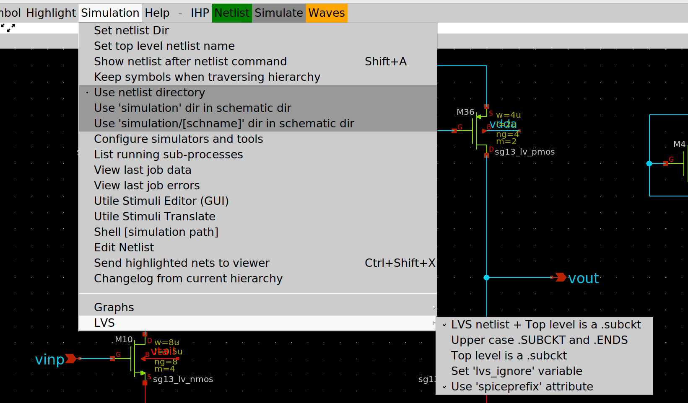

Note this is not selected by default so you will need to do it manually.

Don’t however select it for your top level tb schematic, otherwise
simulation will not run.

Run LVS using klayout (KLVS):
^^^^^^^^^^^^^^^^^^^^^^^^^^^^

This assumes you already have klayout installed.

cd into the following dir:

cd
/home/slice/pdk/iHP/IHP-Open-PDK/ihp-sg13g2/libs.tech/klayout/tech/lvs

For efficiency it is advised to create an alias for the above, something
like:

alias KLVS='cd
/home/slice/pdk/iHP/IHP-Open-PDK/ihp-sg13g2/libs.tech/klayout/tech/lvs'

python3 run_lvs.py --layout=<PATH_TO_GDS_FILE>
--netlist=<PATH_TO_SPICE_FILE--run_dir=<PATH_TO_RUNDIR>

An example is shown below:

python3 run_lvs.py
--layout=/home/slice/xschem/tb_inverter/LVS/inverter2.gds
--netlist=/home/slice/xschem/tb_inverter/LVS/inverter2.spice
--run_dir=/home/slice/xschem/tb_inverter/LVS

When run, you may (or may not!) see the below message:

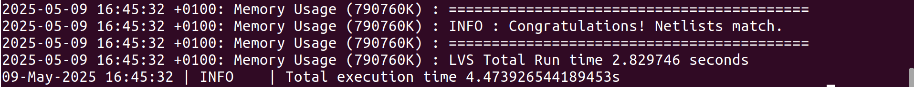

When run, the tool will create an \_extracted.cir which is essentially a
spice representation of the .gds file. It will also create a .lvsdb file
which is intended to be the LVS debug file. I say “intended” as debug
with KLVS is extremely difficult (no meaningfull statements produced!).
In fact, this is one of the main drawbacks of KLVS in my opinion.

Run LVS using netgen:
^^^^^^^^^^^^^^^^^^^^^

In order to compare the layout with the schematic, netgen first needs a
spice representation of the .gds layout file. KLVS is perfect for
generating this, as described above.

cd into the directory containing the \_extracted.cir and .spice file and
run the following command:

netgen -batch lvs "inverter2_extracted.cir TOP" "inverter2.spice TOP"
/home/slice/pdk/iHP/IHP-Open-PDK/ihp-sg13g2/libs.tech/netgen/ihp-sg13g2_setup.tcl

Note how the .subckt name (e.g. TOP) needs to be specified for both
netlists.

Upon running the above, user will notice a dramatic speed increase over
KLVS. When complete, user may see the below message:

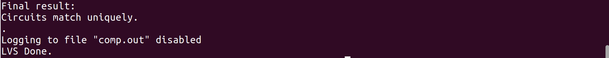

Run results are contained in a comp.out file located in the dir netgen
was run from. As per below, you can see the results to be very easy to
read and hence debug if required.

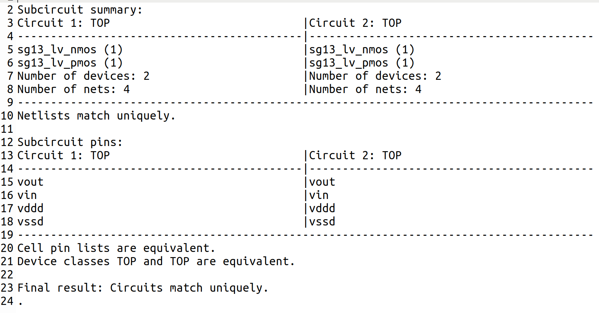

Conclusions:
^^^^^^^^^^^^^^^

KLVS is slower than netgen and extremely difficult to debug. In
addition, it has been found to not detect differences in netnames (see
Appendix #1). In contrast, netgen is faster, much easier to debug and
found to reliably report LVS differences. The recommended flow (in my
opinion anyway!) is to run KLVS to generate the \_extracted.cir
representation of the .gds file and then run netgen on this.

Unfortunately neither KLVS or netgen give a happy face when netlists
match (as we are all used to with Calibre :-(!!!).

Note: This doc shows you how to get LVS running. Debugging is another
thing. At time of writing this doc I am currently finding this task very
challenging so will update the doc with further insights once I become
more experienced in LVS debug using these tools.

Appendix #1: LVS investigations using klayout (KLVS) and netgen:
^^^^^^^^^^^^^^^^^^^^^^^^^^^^^^^^^^^^^^^^^^^^^^^^^^^^^^^^^^^^^^^

*Following are 6 examples testing LVS using klayout / netgen on a simple
inverter*

**Main points:**

- Example #1 confirms KLVS is working for matching .spice / .gds files

- Example #1 confirms netgen is working for matching .spice / .cir files

- Examples #2 and #3 show KLVS doesn’t flag an error if net names are
not the same (e.g. vout2 in .spice file and vout in .gds file or vice
versa)

- Examples #2 and #3 show netgen does flag an error if net names are not
the same (e.g. vout2 in .spice file and vout in \_extracted.cir file or
vice versa)

- Example #4 and #5 show debug to be very difficult in KLVS while netgen
clearly shows the the cause of LVS errors.

- Example #6 shows KLVS and netgen to ignore ‘ng’ parameter (# of
fingers), as expected

- Running all examples showed netgen to be much faster than KLVS

**Example #1:** LVS clean example:

- Extracted.cir file:

- Spice file:|image1|

- Result:|image2|

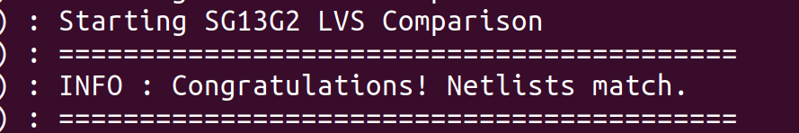

- Netgen result:

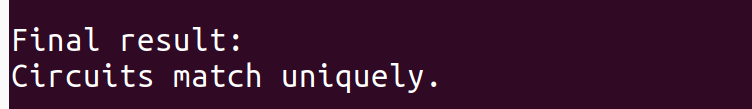

**Example #2:** Manually edit spice file (change vout to vout2):

- Extracted.cir file: No change from example #1.

- Spice file:

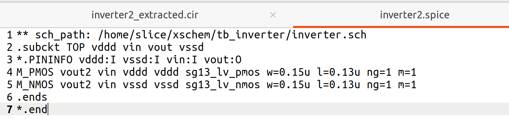

- Result:

- Netgen result:

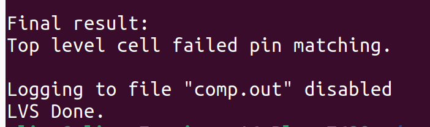

**Example #3**: Manually edit layout (change vout to vout2):

- Extracted.cir file:

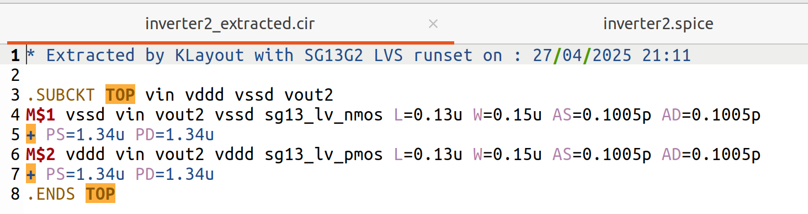

- Spice file: No change from example #1.

- Result:

- Netgen result:

**Example #4**: Manually edit spice file (change PMOS channel length
from 0.13 to 0.14u):

- Extracted.cir file: No change from example #1.

- Spice file:

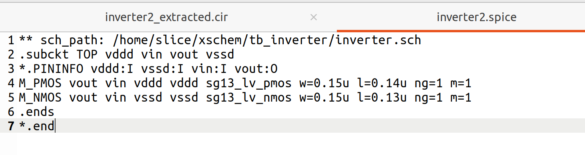

- Result:

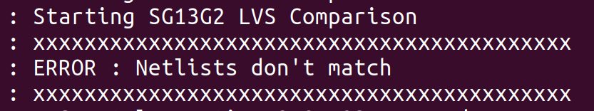

- Debug:

Contents of .lvsdb file do not obviously show that the reason for the
LVS error is due to the PMOS channel lengths not matching.

- Netgen result:

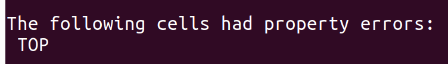

- Netgen debug:

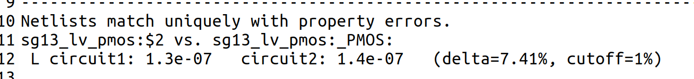

**Example #5**: Manually edit spice file (change PMOS m from 1 to 2):

- Extracted.cir file: No change from example #1.

- Spice file:

- Result:

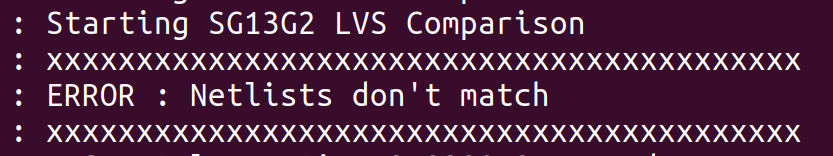

- Debug:

Contents of .lvsdb file do not obviously show that the reason for the
LVS error is due to the PMOS mults not matching.

- Netgen result:

- Netgen debug:

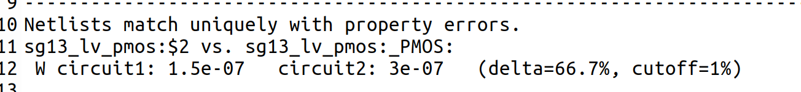

**Example #6**: Manually edit spice file (change PMOS ng from 1 to 2):

- Extracted.cir file: No change from example #1.

- Spice file:

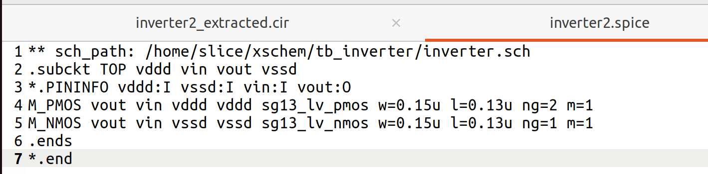

- Result:

- Netgen result:

- Remark:

This result is expected since as stated in the docs:

*The ng parameter will be ignored, as the w represents total width of
all fingers.*

Ref [Tim Edwards}: “This is in line with BSIM definitions which treat W
as total width of all fingers. There is clearly some confusion on that
point, and it may be that some foundries have opted to treat W as width
of each finger in spite of the BSIM spec”

This means the following in schematic:

- The below device has a physical width = 0.3um.

- It does not have a physical width = 0.3um*2

- In other words “w” does not mean finger width but total width

- The below device in layout will appear as 2 fingers each with width =
0.15um to give a 0.3um total width

- This is slightly different to other pdks where finger width is
specified instead of total width

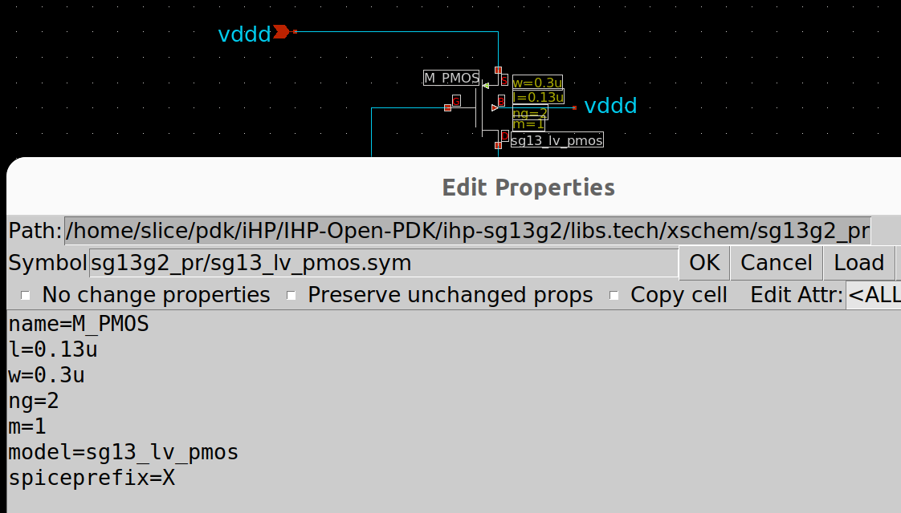

**Acknowledgments:**

Thanks to Tim Edwards, D.M.Bailey and Krzysztof Herman for their
valuable inputs.

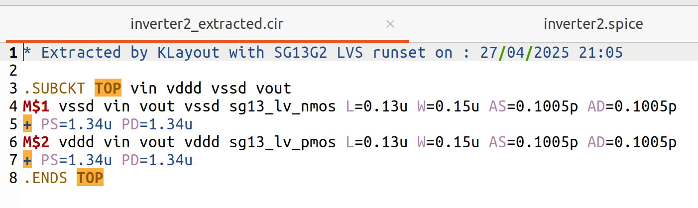
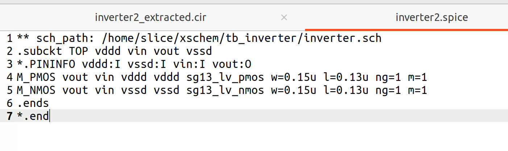
