gLayout
========================

Docker Environment Setup
---------------------

This document outlines the procedure for establishing a robust
development environment for open-source design. This environment will be
provisioned within a containerised system, a sandboxed operating system
built from the
`IIC-OSIC-TOOLS <https://hub.docker.com/r/hpretl/iic-osic-tools>`__
Docker image. This approach ensures a consistent, isolated, and
reproducible workspace, minimising conflicts with your host system.

To facilitate the setup of this environment, two primary software
components must be installed on your local machine:

1. **Docker Desktop (or Docker CE):** This application provides a
      graphical user interface (GUI) for managing Docker containers and
      images. It simplifies the orchestration of containerised
      environments.

2. **Git Client:** A version control system client essential for cloning
      (downloading) open-source code repositories and associated
      scripts, primarily from platforms such as GitHub.

Key Terminologies in Docker Containerization
--------------------------------------------

To ensure a clear understanding of the architectural components, the
following key terms are defined:

-  **Docker:** Refers to the foundational platform and set of tools used
      to develop, ship, and run applications within containers. It is
      the underlying engine for containerization.

-  **Docker Desktop:** The desktop application that integrates Docker
      Engine, Docker CLI client, Docker Compose, and other
      functionalities, providing a comprehensive environment for
      managing containerised applications on a local machine.

-  **Docker Image:** A lightweight, standalone, executable package that
      includes everything needed to run a piece of software, including
      the code, a runtime, libraries, environment variables, and config
      files. In our context, the IIC-OSIC-TOOLS image serves as a frozen
      template for our development environment.

-  **Docker Container:** A runnable instance of a Docker Image. It
      represents a lightweight, portable, and isolated operating system
      environment. Multiple containers can be instantiated from a single
      Docker Image, each operating independently.

For a more comprehensive understanding of Docker, further resources are
available `here <https://docs.docker.com/>`__.

Following the installation of these prerequisite tools, we will proceed
to construct the containerised development environment. This container
will contain a comprehensive suite of tools specifically curated for
open-source design workflows, including.

-  `XSCHEM <https://xschem.sourceforge.io/stefan/index.html>`__ (Used
      for schematic capture and netlisting)

-  Open-Source `GF180
      PDK <https://gf180mcu-pdk.readthedocs.io/en/latest/>`__ , `SKY130
      PDK <https://skywater-pdk.readthedocs.io/en/main/>`__ and `IHP130
      PDK <https://ihp-open-pdk-docs.readthedocs.io/en/latest/>`__

-  Glayout (Analog Design Tool)

-  `Magic <http://opencircuitdesign.com/magic/>`__ (Used for VLSI layout
      and Extraction)

-  `Netgen <http://opencircuitdesign.com/netgen/>`__ (Used for LVS
      checking)

-  `Klayout <https://www.klayout.de/>`__ (Used for Layout,
      Visualisation, and DRC/LVS)

-  `Ngspice <https://ngspice.sourceforge.io/>`__ (Simulations )

-  `Xyce <https://xyce.sandia.gov/documentation-tutorials/>`__ (Used for
      Simulations )

-  `CACE <https://cace.readthedocs.io/en/latest/>`__, (Used for
      Automatic Circuit Characterisation)

**Install Git Client:**

Installation is platform-dependent. See `the steps
here <https://github.com/git-guides/install-git>`__

(optional) What is Git? Know more
`here <https://github.com/git-guides>`__

Why Git? We will use git to pull (or download) the open-source
codes/scripts hosted on GitHub.com. Later, we will use Git again to push
(or upload) our design contributions to the open-source repositories.

**
Install Docker Desktop:**

Docker is cross-platform and installable anywhere. Docker Desktop is the
all-in-one package to build images, run containers, and so much more. In
this step, we are going to

-  Install the Docker Desktop software

-  Pull the IIC-OSIC-TOOLS Docker image.

Docker Install
--------------

The installation process for Docker varies based on the platform you are
using. Please follow the specific instructions for your platform:

-  *Step 1:* Navigate to the Docker Desktop
      `website <https://docs.docker.com/get-started/introduction/get-docker-desktop/>`__
      and install the corresponding executables or binaries (an
      excellent guide for Windows and Mac is available
      `here <https://medium.com/@javatechie/docker-installation-steps-in-windows-mac-os-b749fdddf73a>`__)

   -  `Install Docker Desktop on
         Mac <https://docs.docker.com/desktop/setup/install/mac-install>`__

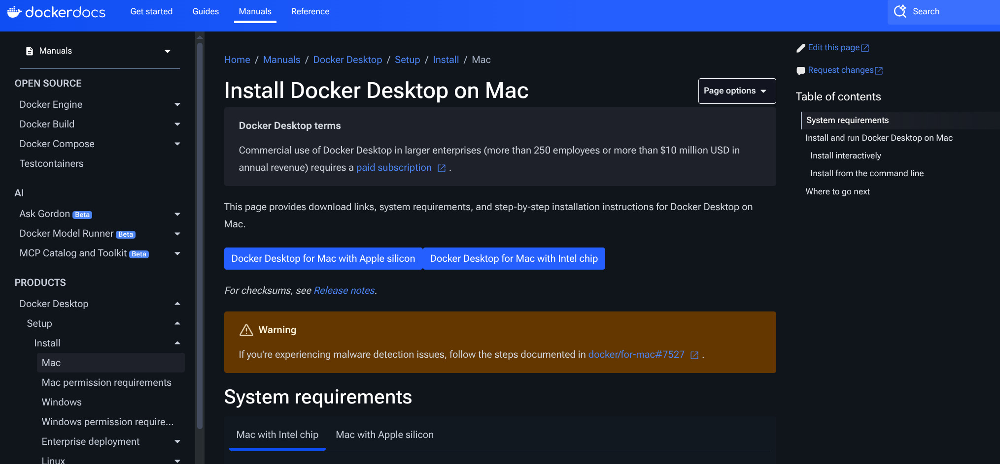

-  `Install Docker Desktop on
      Windows <https://docs.docker.com/desktop/setup/install/windows-install>`__

.. image:: media/getStarted/glayout/image62.png
   :width: 75%

-  `Install Docker Desktop for
      Linux <https://docs.docker.com/desktop/setup/install/linux/>`__
      |image1|

   -  `Install on
         Ubuntu <https://docs.docker.com/desktop/setup/install/linux/ubuntu/>`__

   -  `Install on
         Debian <https://docs.docker.com/desktop/setup/install/linux/debian/>`__

   -  `Install on Red Hat Enterprise Linux
         (RHEL) <https://docs.docker.com/desktop/setup/install/linux/rhel/>`__

   -  `Install on
         Fedora <https://docs.docker.com/desktop/setup/install/linux/fedora/>`__

   -  `Install on
         Arch <https://docs.docker.com/desktop/setup/install/linux/archlinux/>`__

-  *Step 2:* Open the Docker Desktop app and agree to the Service
      Agreement and use recommended settings

..

   |image2|\ |image3|

-  *Step 3:* Feel Free to skip the Account Creation dialogue. The skip
      option is in the top right

..

   |image4|\ |image5|

-  *Step 4:* Navigate to the
      `sscs-chipathon-2025 <https://github.com/sscs-ose/sscs-chipathon-2025>`__
      Repository and clone / download it.

..

   .. image:: media/getStarted/glayout/image59.png
      :width: 75%

-  *Step 5:* Now, we will give security permission to Docker to interact
      with the localhost of the Host OS (your machine where Docker is
      running). This is also platform-dependent.

   -  Linux/ WSL on Windows

      -  Open a terminal and run “xhost +Local:\*”

   -  Mac

      -  Visit https://www.xquartz.org/ and download the “Quick
            Download” file

      -  Once the package is installed, run the installer

      -  Reboot your computer after XQuartz is installed

      -  Launch the XQuartz application

         -  Type in “xhost + 127.0.0.1”

..

   .. image:: media/getStarted/glayout/image63.png
      :width: 75%

-  | Go to XQuartz preferences > Security and check these options
      | ​​\ |image6|

-  *Step 6:* Now we are going to build the container from the image.

..

   The start-up scripts “start_XX.sh”(for Linux/Mac) or
   “start_XX.bat”(for Windows) use different ways to build the
   container. Follow the README at the `sscs-chipathon-2025
   repo <https://github.com/sscs-ose/sscs-chipathon-2025/blob/main/resources/IIC-OSIC-TOOLS/README.md>`__
   for details about different startup scripts.

-  **First Startup**

..

   Please note: When building for the first time, the scripts are going
   to pull the Docker image from the Docker Hub. This will take time and
   space in your storage. You should have your Docker Engine running.

   Here, we are going to focus on building the script with VNC and with
   X11 forwarding, respectively.

-  **Building with VNC**

   -  On Linux/Mac

      -  Navigate to the sscs-chipathon-2025 /resources / IIC-OSIC-TOOLS
            folder

      -  Open a terminal (or xterm) and execute “chmod +x
            ./start_chipathon_vnc.sh”

      -  Open a terminal (or xterm) and execute
            “./start_chipathon_vnc.sh”

..

   .. image:: media/getStarted/glayout/image53.png
      :width: 75%

-  Note: this created a container named
      “iic-osic-tools_chipathon_xvnc_uid\_…” and mapped a folder
      “/home/$USER/eda/designs” to the docker (i.e. anything you
      copy/paste to this folder will be visible to the docker)

-  You can see the newly built container in the **Container** tab
      (mid-left) in the Docker Desktop Dashboard. Note the container ID.
      This will be useful later.

..

   .. image:: media/getStarted/glayout/image74.png
      :width: 75%

-  You can now access the Desktop Environment of the OS running in the
      container through your browser
      (`http://localhost <http://localhost/>`__). The default password
      is **abc123**.

..

   .. image:: media/getStarted/glayout/image49.png
      :width: 75%

   .. image:: media/getStarted/glayout/image75.png
      :width: 75%

-  On Windows:

   -  With WSL, you can use the same steps as Linux

   -  With standard windows, you can double-click to execute
         “start_chipathon_vnc.bat” and allow permissions.

..

   |image7|\ |image8|\ |image9|

-  Then, you can open the desktop environment in your browser
      (`http://localhost <http://localhost/>`__). The default password
      is **abc123**.

-  **Building with X11**

   -  X11 forwarding allows the build container to use the Host OS’s
         display to show graphical images

   -  The Build Procedure is the same, except we will use the
         “start_x.sh” script (or “start_chipathon_x.bat” script in case
         of Windows).

   -  Note: “start_chipathon_x.sh” script *might* not work in all Linux
         Distro. See `this
         issue <https://github.com/iic-jku/IIC-OSIC-TOOLS/issues/135>`__
         at the IIC repo. The current best suggestion is to go with
         Docker CE

   -  This script should open a terminal in your native display (**not**
         through a browser window)

..

   .. image:: media/getStarted/glayout/image51.png
      :width: 75%

-  Now you can open graphical applications directly in your native
      display, for example: Let's try to open Klayout by typing
      “\ *Klayout&*\ ” in the terminal window

..

   .. image:: media/getStarted/glayout/image69.png
      :width: 75%

The difference with VNC and X11 is how Docker Container uses the
display. VNC starts a remote display protocol to show the desktop
environment of the Container OS that you can view through your browser
window, and X11 lets the container use your native display of the host.

**Note: :mark:`you can add` DESIGNS="your/path/to/directory"
./start_vnc_GL.sh :mark:`to map a user-defined directory to the Docker
Container. For details, see the JKU
`IIC-OSIC-TOOLS <https://github.com/iic-jku/IIC-OSIC-TOOLS/iss>`__
repo.`**

Glayout Specific Steps
----------------------

Instructions up to this stage are common for all. In the following, we
will see Glayout-specific steps. For Glayout, we are going to build the
Container with additional steps (with the same scripts) to forward Port:
888 (alongside VNC or X11) to start a Jupyter Server to execute Glayout
Notebooks.

\*Note: gLayout repo can be cloned or downloaded from
`here <https://github.com/ReaLLMASIC/gLayout/tree/main>`__. You will
need it for Tutorials.

\**Note: Keep an eye on the different containers that are being built
for different purposes. They have different names and container IDs.

TL;DR Once Docker is up and running, go to the *Container* tab in Docker
Desktop, click on the container name and navigate to the *Exec* tab and
execute

*\`bash /dockerstartup/scripts/run_GL.sh\`* in the terminal of Docker.

*Step 1:* Build Docker container with the “start_chipathon\_[--].[--]”
scripts as described before.

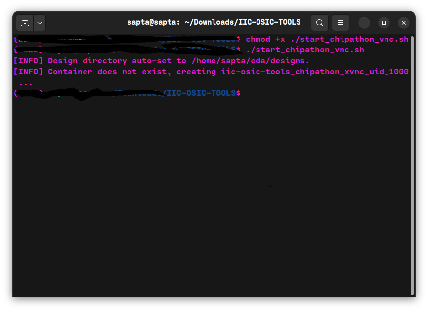

*Step 2:* Open Docker Desktop Dashboard. Go to the *Containers* tab, and
you should see the container running

   .. image:: media/getStarted/glayout/image9.png
      :width: 75%

*Step 3:* Navigate to the \`Exec\` tab

   .. image:: media/getStarted/glayout/image26.png
      :width: 75%

*Step 4:* In the Exec terminal (terminal of Docker)

-  run \`\ *bash /dockerstartup/scripts/run_GL.sh*\ \`

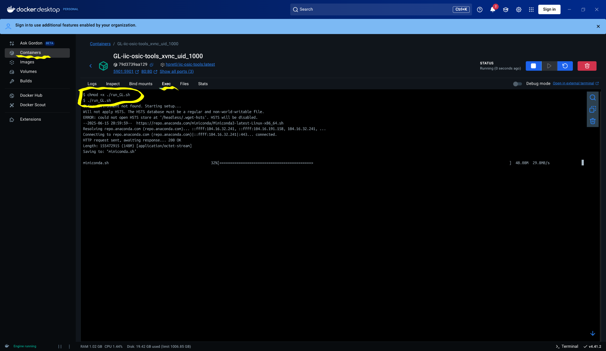

(You can run this command using the VNC or X11 accessed terminal as
well.)

This will set up and install the necessary components (will take some
time) for the gLayout and will start a Jupyter server to access it. You
can access it from your browser “\ http://localhost:8888/lab\ ” or
VsCode

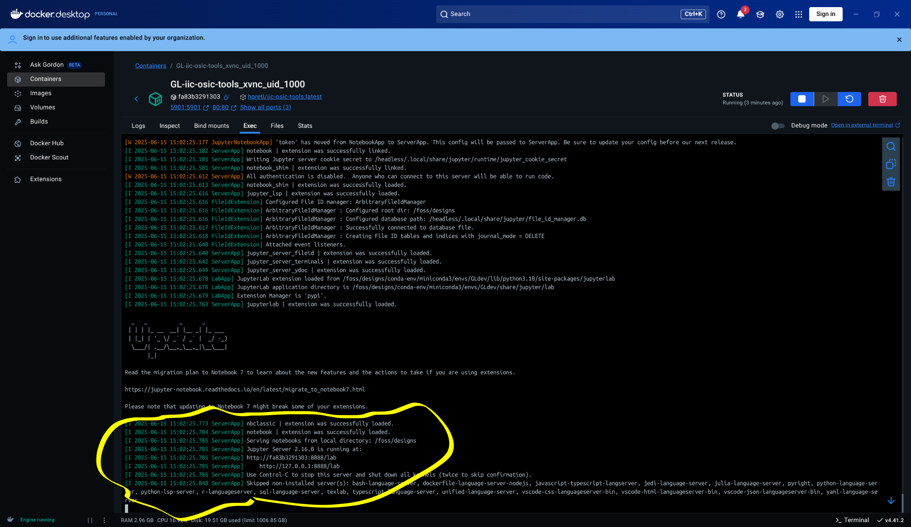

Please note that you would need to restart the Jupyter server if you
close or rebuild the Docker container. You can run it again by executing
the following command in the Exec terminal “bash
/dockerstartup/scripts/run_GL.sh” , again.

In case you don't see the “GLdev” kernel in your Jupyter Server

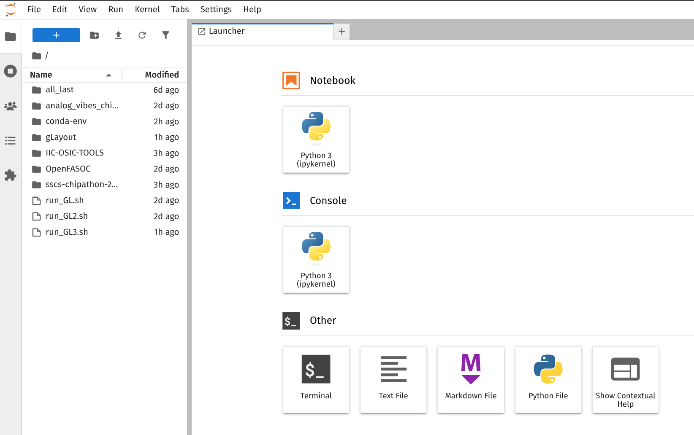

In the “Exec” terminal,

-  First run python -m ipykernel install --user --name="GLdev"

-  Then run bash /dockerstartup/scripts/run_GL.sh

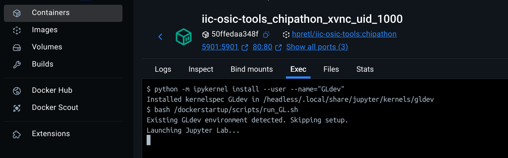

Then you should see the GLdev Kernel. Don’t forget to choose it for all
gLayout code

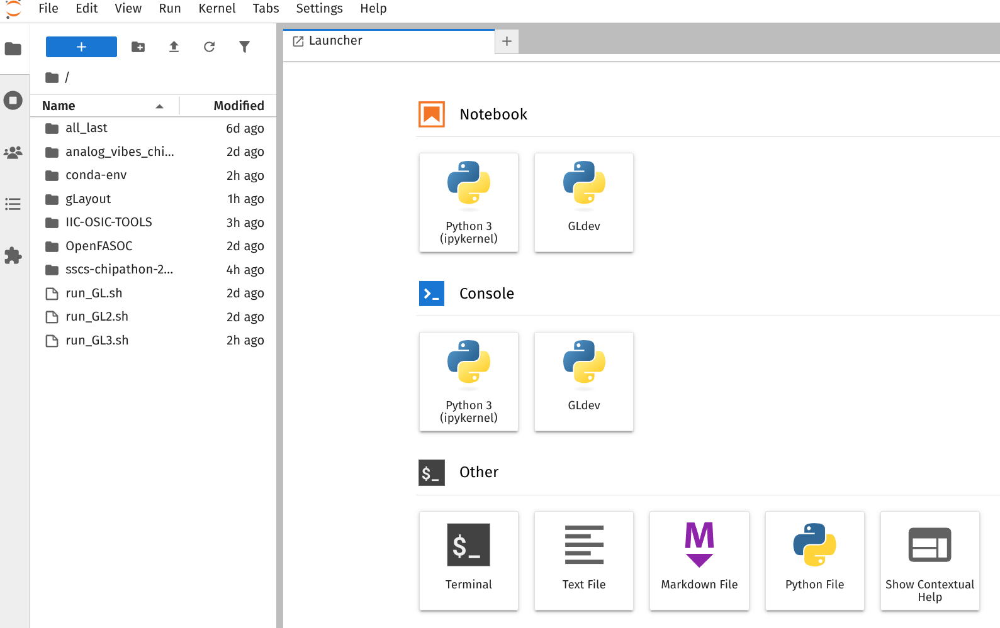

Installing KLive and PDK Colour Schemes
---------------------------------------

*To visualise the GDS files generated by the Glayout, you can use the
\_.show() function. For this to work, you need to have Klive plugin
installed and running in the Klayout*

1. Run your container using the previously described run command

2. Run KLayout by just typing “klayout” in the terminal of the Docker
      container

3. Install KLive

   a. Go to Tools -> Manage Packages -> Install New Packages -> Search

   b. Search for KLive

   c. | Install the package that looks like this:
         | |image10|

4. Install PDK Color Schemes (You can just source the PDK too with
      Klayout Path)

   a. Go to Tools -> Manage Packages -> Install New Packages -> Search

   b. Search for gf180

   c. Install the package that looks like this:

..

   .. image:: media/getStarted/glayout/image34.png
      :width: 75%

5. Once it's installed on your host system. Type in “docker ps -a”. This
      will list all of your running containers. Copy the container ID of
      the most recently started one or the one you installed Klive

6. **Enter the command**

..

   **“docker commit -a "Jane Doe" -m "Installed Klive" <Container ID>
   hpretl/iic-osic-tools:chipathon”**

   **Note: without committing to the image, Docker image won't retain
   the changes.**

**Installing the classical Docker CE -**

*sudo apt-get install docker-ce docker-ce-cli containerd.io
docker-buildx-plugin docker-compose-plugin*

**Miscellaneous Docker Commands -**

1. To remove the container, run the command:

   a. *(Mac) docker container rm glayoutcontainer*

   b. *(Linux/WSL) docker rm glayoutcontainer*

2. To stop a container, run the command:

   a. *(Mac) docker container stop glayoutcontainer*

   b. *(Linux/WSL) docker stop glayoutcontainer*

3. To restart the container, run the command:

   a. *(Mac) docker container restart glayoutcontainer*

   b. *(Linux/WSL) docker restart glayoutcontainer*

4. To execute a running container, first check its status by running

   a. *(Mac) docker container ls -a (Linux/WSL) docker ls -a*

   b. *docker exec -it glayoutcontainer bash* (if *glayoutcontainer* is
         running) (-it runs the container in interactive mode)

5. To make a permanent change to Docker:

   a. *docker container commit <container ID>*

   b. *docker commit <container ID>*

**Note: ‘exit’ in a running Docker container halts all running processes
and stops. A graceful shutdown can be achieved by using docker stop
glayoutcontainer**

We acknowledge Kwantae Kim for letting us use some graphics materials
from his blog and providing advice. Please check out (for general
open-source flow) Kwantae Kim's `'Setting Up Open Source Tools with
Docker' <https://kwantaekim.github.io/2024/05/25/OSE-Docker/>`__!

Legacy: Glayout DEV Environment Setup 
------------------------------------------

(based on GLayout Docker Image hosted
`here <https://github.com/idea-fasoc/OpenFASOC/>`__)

-  Introducing the `Tools 1 <#_4ins7t8hyerw>`__

-  `Install with Docker (Recommended method) 1 <#_cfs5dkl45z9f>`__

   -  `Videos 1 <#_4nrx24gadq7h>`__

   -  `Steps <#_w157p6yst78f>`__ `3 <#_m4p3k620wxsu>`__

-  Installing Git and cloning the
      `OpenFASOC <https://github.com/idea-fasoc/OpenFASOC>`__ repository

-  `Checking your install 4 <#_koqgh2m0p9eb>`__

-  `Getting started with GLayout 4 <#_g7fp5cujyjr9>`__

**Introducing the Tools**

The following steps will install a container (a sand-boxed OS) with many
tools you can use to get started with open-source design, including:

-  GF180 PDK and SKY130 PDK

-  Magic (Used for Extraction)

-  Netgen (Used for LVS checking)

-  Klayout (Used for Visualisation, and DRC/LVS)

-  Ngspice (Pre- & Post PEX Simulations )

-  Glayout (Analog Design Tool)

**Install with Docker**

**The easiest way to install the tools is using Docker.**

-  *Videos*

..

   The following videos will guide you through the process of installing
   and using Docker on various platforms.

-  Mac: `Mac: Install Open Source Design
      Tools <https://youtu.be/Cg5tn6dt1Fs>`__

-  Ubuntu Linux (you will need the Docker install steps for your distro,
      see links below): `Linux: Install Open Source Design
      Tools <https://youtu.be/xUYIoLpUuAo>`__

-  *Steps*

..

   Docker is cross-platform and installable anywhere. The installation
   process for Docker varies based on the platform you are using. Please
   follow the specific instructions for your platform:

-  `Install Docker on
      Mac <https://docs.docker.com/desktop/install/mac-install/>`__

-  `Install Docker on Linux <https://docs.docker.com/engine/install/>`__
      (select your OS below)

   -  `CentOS <https://docs.docker.com/engine/install/centos/>`__

   -  `Ubuntu <https://docs.docker.com/engine/install/ubuntu/>`__

   -  `Fedora <https://docs.docker.com/engine/install/fedora/>`__

   -  `Debian <https://docs.docker.com/engine/install/debian/>`__

   -  `Red-Hat <https://docs.docker.com/engine/install/rhel/>`__

-  Install git so that you can get the Docker image

   -  Installation is platform dependent, `you can see the steps
         here <https://git-scm.com/book/en/v2/Getting-Started-Installing-Git>`__

-  Once Docker and git are installed, clone the OpenFASOC repository

1. Navigate to the Docker folder

+-----------------------------------------------------------------------+
|    git clone https://github.com/idea-fasoc/OpenFASOC.git              |
+=======================================================================+
+-----------------------------------------------------------------------+

2. Navigate to the Docker folder

+-----------------------------------------------------------------------+
|    cd OpenFASOC/docker/conda                                          |
+=======================================================================+
+-----------------------------------------------------------------------+

3. **:mark:`(Mac only)`**, Edit “\ *~/.docker/config.json*\ ” to remove
      the line *“credsStore” : “desktop”*

4. Build and run the Docker container

+-----------------------------------------------------------------------+
| **Linux/WSL**                                                         |
+=======================================================================+
| -  (*Building the Docker Image*) sudo docker build -t                 |
|       openfasoc:glayout .                                             |
|                                                                       |
| -  (Navigating back to the main directory) cd ../../                  |
|                                                                       |
| -  (Starting the Docker Image) sudo docker run -v $(pwd):$(pwd) -w    |
|       $(pwd) --name glayoutcontainer -it openfasoc:glayout            |
|                                                                       |
| -  (Installing packages) pip install -r requirements.txt              |
|                                                                       |
| -  (Installing packages) pip install gdstk prettyprint                |
+-----------------------------------------------------------------------+
| **Mac**                                                               |
+-----------------------------------------------------------------------+
| -  sudo docker build -t openfasoc:glayout . --platform=”linux/amd64”  |
|                                                                       |
| -  cd ../../                                                          |
|                                                                       |
| -  sudo docker run -v $(pwd):$(pwd) -w $(pwd) --name glayoutcontainer |
|       -it openfasoc:glayout                                           |
|                                                                       |
| -  pip install -r requirements.txt                                    |
|                                                                       |
| -  pip install gdstk prettyprint                                      |
+-----------------------------------------------------------------------+

**For running graphical applications (such as KLayout) in the Docker
container**

5. Port graphical applications in Docker (so you can run KLayout inside
      the Docker container)

   -  Mac

      -  Visit https://www.xquartz.org/ and download the “Quick
            Download” file

      -  Once the package is installed, run the installer

      -  Reboot your computer after XQuartz is installed

      -  Launch the XQuartz application

         -  Type in “xhost + 127.0.0.1”

..

   .. image:: media/getStarted/glayout/image63.png
      :width: 75%

-  | Go to XQuartz preferences > Security and check these options
      | ​​\ |image11|

-  Open the Docker application or use the docker start command in the
      terminal and start the container, and copy the container ID

..

   .. image:: media/getStarted/glayout/image18.png
      :width: 75%

-  Linux/WSL

   -  Open a terminal and run “xhost +Local:\*”

6. Open the Docker Container (the following commands create a new
      container from the image).

..

   *:mark:`Note: If you already have a Docker container running, don’t
   make a new one.`*

+-----------------------------------------------------------------------+
| **Linux**                                                             |
+=======================================================================+
| sudo docker run -v $(pwd):$(pwd) -w $(pwd) -e DISPLAY -v              |
| /temp/.X11-unix:/tmp/.X11-unix --net=host -it --name glayoutcontainer |
| openfasoc:glayout                                                     |
+-----------------------------------------------------------------------+
| **WSL**                                                               |
+-----------------------------------------------------------------------+
| docker run -it -v /tmp/.X11-unix:/tmp/.X11-unix -v                    |
| /mnt/wslg:/mnt/wslg -v $(pwd):$(pwd) -w $(pwd) -e DISPLAY -e          |
| WAYLAND_DISPLAY -e XDG_RUNTIME_DIR -e PULSE_SERVER --name             |
| glayoutcontainer openfasoc:glayout                                    |
+-----------------------------------------------------------------------+
| **Mac**                                                               |
+-----------------------------------------------------------------------+
| open -a xquartz                                                       |
|                                                                       |
| sudo docker run --env=DISPLAY=host.docker.internal:0 -v $(pwd):$(pwd) |
| -w $(pwd) -it --name glayoutcontainer openfasoc:glayout               |
+-----------------------------------------------------------------------+

**Miscellaneous Docker Commands -**

1. To remove the container, run the command:

   a. *(Mac) docker container rm glayoutcontainer*

   b. *(Linux/WSL) docker rm glayoutcontainer*

2. To stop a container, run the command:

   a. *(Mac) docker container stop glayoutcontainer*

   b. *(Linux/WSL) docker stop glayoutcontainer*

3. To restart the container, run the command:

   a. *(Mac) docker container restart glayoutcontainer*

   b. *(Linux/WSL) docker restart glayoutcontainer*

4. To execute a running container, first check its status by running

   a. *(Mac) docker container ls -a (Linux/WSL) docker ls -a*

   b. *docker exec -it glayoutcontainer bash* (if *glayoutcontainer* is
         running) (-it runs the container in interactive mode)

5. To make a permanent change to Docker:

   a. *docker container commit <container ID>*

   b. *docker commit <container ID>*

   c. 

**Note: ‘exit’ in a running Docker container halts all running processes
and stops. A graceful shutdown can be achieved by using docker stop
glayoutcontainer**

*Checking your install*

Once the install is complete, you can check your install by running the
following command

+-----------------------------------------------------------------------+
| **Check Install**                                                     |
+=======================================================================+
| # assuming you are in the OpenFASOC directory                         |
|                                                                       |
| -  *cd openfasoc/generators/glayout*                                  |
|                                                                       |
| -  *python3 test_glayout.py*                                          |
+-----------------------------------------------------------------------+

This script will test if:

1. The Python version meets requirements (3.10 or newer)

2. The conda packages have been installed

3. The PDKs sky130 or GF180 have been installed and are in their
      expected locations

4. Python packages have been properly installed

5. glayout is working as required. The script:

   a. places an nmos component

   b. runs a Layout vs. Schematic check on it

*Installing KLive*

1. Run your container using a previously described run command (Step 8
      of Install with Docker)

2. Run KLayout by just typing “klayout” in the Docker container

3. Install KLive

   a. Go to Tools -> Manage Packages -> Install New Packages -> Search

   b. Search for KLive

   c. | Install the package that looks like this:
         | |image12|

4. Once it's installed on your host system. Type in “docker ps -a”. This
      will list all of your running containers. Copy the container ID of
      the most recently started one or the one you installed Klive

5. Enter the command “docker commit <container id> openfasoc:glayout

**Common Issues**

1. “Conflict. The container name ‘/glayoutcontainer’ is already in use
      by container…”?

..

   Remove the container with docker rm <container id> or start the
   container again with docker start <container id>. It is up to you to
   decide whether to reuse or remove and run a container. Going with the
   latter will give you the option to mount folders in your host system.

2. WSL:

..

   Error: cannot connect to Docker daemon at unix:///var/run/docker.sock
   …

a. | Select one after running this command:
      | sudo update-alternatives –config iptables

b. Start the Docker daemon

..

   sudo service docker start

c. Check the status of the Docker daemon

..

   sudo service docker status

3. Info: Could not load the Qt platform plugin "xcb" in "" even though
      it was found.

..

   Fatal: This application failed to start because no Qt platform plugin
   could be initialized. Reinstalling the application may fix this
   problem.

   MacOS: Make sure you follow all of the steps within Step 7 and 8 in
   this document. When you run the container make sure it has the
   argument --env=DISPLAY=host.docker.internal:0

   All other systems: Make sure you run the corresponding run command
   provided in step 8 of this document with the relevant command line
   arguments.

4. Getting a bunch of E: Unable to locate package errors within your
      container?

   a. First reboot your computer.

   b. Reinstall the Docker engine on
         `Linux <https://docs.docker.com/engine/install/>`__ or
         `Mac <https://docs.docker.com/desktop/install/mac-install/>`__

   c. | Run these commands:
         | docker stop $(sudo docker ps -aq)
         | docker container prune
         | docker image prune
         | sudo docker builder prune-- all

   d. Restart the building process

Legacy: Docker Install

.. _docker-environment-setup-1:

Docker Environment Setup
------------------------

**Introducing the Tools:**

The Development Environment is set up in a container (a sandboxed OS)
built from the IIC-OSIC-TOOLS Docker image. This instruction set intends
to guide you in installing the required tools to get started with the
open-source design.

You will need two software to install on your machine to set up the
environment:

-  Docker Desktop: A GUI-based software to manage your containers

-  Git Client: A tool to help pull open-sourced code and scripts from
      GitHub

Important Terms: **Docker:** The software/tool that runs a sandboxed OS.
**Docker Desktop**: The GUI client that manages Docker. **Docker
Image**: The image of the frozen OS image with pre-installed
applications that is provided to Docker. **Docker Container**: The OS
that we build from a Docker image and interact with it. Multiple
containers can be built from the same image. Know More
`here <https://docs.docker.com/>`__

Thereafter, we will build a container (a sandboxed OS) with many tools
you can use to get started with open-source design, including:

-  GF180 PDK and SKY130 PDK

-  Magic (Used for Extraction)

-  Netgen (Used for LVS checking)

-  Klayout (Used for Visualisation, and DRC/LVS)

-  Ngspice (Pre- & Post PEX Simulations )

-  Glayout (Analog Design Tool)

**
Install Git Client:**

Installation is platform-dependent. See `the steps
here <https://github.com/git-guides/install-git>`__

(optional) What is Git? Know more
`here <https://github.com/git-guides>`__

Why Git? We will use git to pull (or download) the open-source
codes/scripts hosted on GitHub.com. Later, we will use Git again to push
(or upload) our design contributions to the open-source repositories.

**
Install Docker Desktop:**

Docker is cross-platform and installable anywhere. Docker Desktop is the
all-in-one package to build images, run containers, and so much more. In
this step, we are going to

-  Install the Docker Desktop software

-  Pull the IIC-OSIC-TOOLS Docker image.

**Docker Install**

The installation process for Docker varies based on the platform you are
using. Please follow the specific instructions for your platform:

-  *Step 1:* Navigate to the Docker Desktop
      `website <https://docs.docker.com/get-started/introduction/get-docker-desktop/>`__
      and install the corresponding executables or binaries (an
      excellent guide for Windows and Mac is available
      `here <https://medium.com/@javatechie/docker-installation-steps-in-windows-mac-os-b749fdddf73a>`__)

   -  `Install Docker Desktop on
         Mac <https://docs.docker.com/desktop/setup/install/mac-install>`__

-  `Install Docker Desktop on
      Windows <https://docs.docker.com/desktop/setup/install/windows-install>`__

.. image:: media/getStarted/glayout/image62.png
   :width: 75%

-  `Install Docker Desktop for
      Linux <https://docs.docker.com/desktop/setup/install/linux/>`__
      |image13|

   -  `Install on
         Ubuntu <https://docs.docker.com/desktop/setup/install/linux/ubuntu/>`__

   -  `Install on
         Debian <https://docs.docker.com/desktop/setup/install/linux/debian/>`__

   -  `Install on Red Hat Enterprise Linux
         (RHEL) <https://docs.docker.com/desktop/setup/install/linux/rhel/>`__

   -  `Install on
         Fedora <https://docs.docker.com/desktop/setup/install/linux/fedora/>`__

   -  `Install on
         Arch <https://docs.docker.com/desktop/setup/install/linux/archlinux/>`__

-  *Step 2:* Open the Docker Desktop app and agree to the Service
      Agreement and use recommended settings

..

   |image14|\ |image15|

-  *Step 3:* Feel Free to skip the Account Creation dialogue. The skip
      option is in the top right

..

   .. image:: media/getStarted/glayout/image42.jpg
      :width: 75%

   .. image:: media/getStarted/glayout/image40.png
      :width: 75%

-  *Step 4:* Search for **IIC-OSIC-TOOLS** Docker image and pull it
      (Don’t run). Note the “hpretl/..” prefix. This step will take some
      time and disk space on your machine

|image16|\ |image17|

-  *Step 4:* You should see the image name in the **images** (mid-left)
      in the Docker Desktop Dashboard after the download

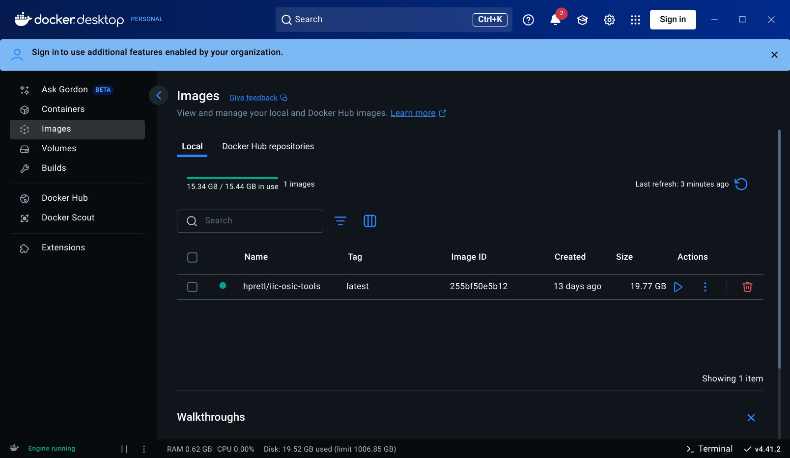

-  *Step 5:* Navigate to the `JKU-IIC-OSIC-Tools
      Repository <https://github.com/iic-jku/IIC-OSIC-TOOLS>`__ and
      download it (Download Zip)

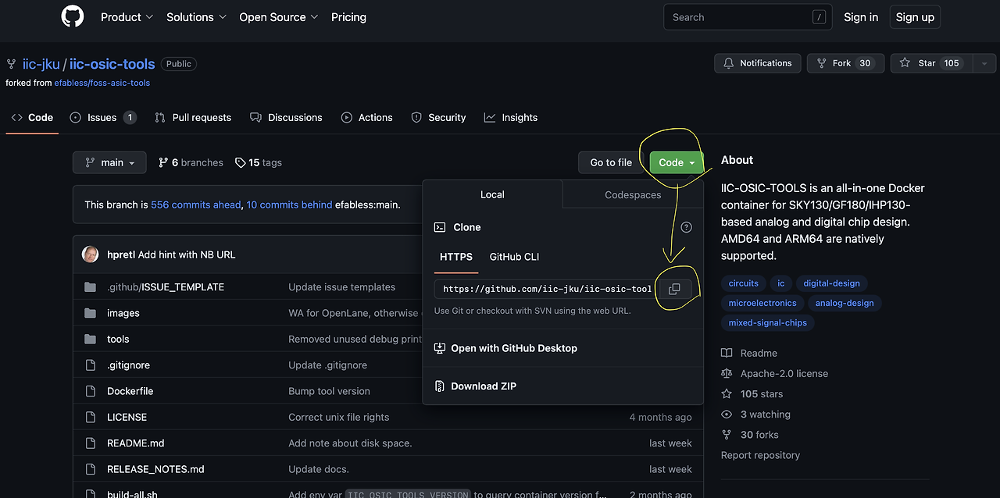

-  *Step 6:* Now, we will give security permission to Docker to interact
      with the localhost of the Host OS (your machine where Docker is
      running). This is also platform-dependent.

   -  Linux/ WSL on Windows

      -  Open a terminal and run “xhost +Local:\*”

   -  Mac

      -  Visit https://www.xquartz.org/ and download the “Quick
            Download” file

      -  Once the package is installed, run the installer

      -  Reboot your computer after XQuartz is installed

      -  Launch the XQuartz application

         -  Type in “xhost + 127.0.0.1”

..

   .. image:: media/getStarted/glayout/image63.png
      :width: 75%

-  | Go to XQuartz preferences > Security and check these options
      | ​​\ |image18|

-  | *Step 7:* Now we are going to build the container from the image.
        The start-up scripts “start_XX.sh”(for Linux/Mac) or
        “start_XX.bat”(for Windows) use different ways to build the
        container. Follow the README at `JKU-IIC-OSIC-Tools
        Repository <https://github.com/iic-jku/IIC-OSIC-TOOLS>`__ for
        details about different startup scripts.
      | Here, we are going to focus on building the script with VNC and
        with X11 forwarding, respectively.

   -  **Building with VNC**

      -  On Linux/Mac

         -  Navigate to the JKU-IIC-OSIC-Tools folder

         -  Open a terminal (or xterm) and execute “./start_vnc.sh”

..

   (Note: you might have to do “chmod +x ./start_vnc.sh”)

   .. image:: media/getStarted/glayout/image53.png
      :width: 75%

-  Note: this created a container named “iic-osic-tools_xvnc_uid\_…” and
      mapped a folder “/home/$USER/eda/designs” to the docker (i.e.
      anything you copy/paste to this folder will be visible to the
      docker)

-  You can see the newly built container in the **Container** tab
      (mid-left) in the Docker Desktop Dashboard. Note the container ID.
      This will be useful later.

..

   .. image:: media/getStarted/glayout/image74.png
      :width: 75%

-  You can now access the Desktop Environment of the OS running in the
      container through your browser
      (`http://localhost <http://localhost/>`__). The default password
      is **abc123**.

..

   .. image:: media/getStarted/glayout/image49.png
      :width: 75%

   .. image:: media/getStarted/glayout/image75.png
      :width: 75%

-  On Windows:

   -  With WSL, you can use the same steps as Linux

   -  With standard windows, you can double-click to execute
         “start_vnc.bat” and allow permissions.

..

   |image19|\ |image20|\ |image21|

-  Then, you can open the desktop environment in your browser
      (`http://localhost <http://localhost/>`__). The default password
      is **abc123**.

-  **Building with X11**

   -  X11 forwarding allows the build container to use the Host OS’s
         display to show graphical images

   -  The Build Procedure is the same, except we will use the
         “start_x.sh” script (or “start_x.bat” script in case of
         Windows).

   -  Note: “start_x.sh” script *might* not work in all Linux Distro.
         See `this
         issue <https://github.com/iic-jku/IIC-OSIC-TOOLS/issues/135>`__
         at the IIC repo.

   -  This script should open a terminal in your native display (**not**
         through a browser window)

..

   .. image:: media/getStarted/glayout/image51.png
      :width: 75%

-  Now you can open graphical applications directly in your native
      display, for example: Let's try to open Klayout by typing
      “\ *Klayout&*\ ” in the terminal window

..

   .. image:: media/getStarted/glayout/image69.png
      :width: 75%

The difference with VNC and X11 is how Docker Container uses the
display. VNC starts a remote display protocol to show the desktop
environment of the Container OS that you can view through your browser
window, and X11 lets the container use your native display of the host.
It runs the CLI interface of the Container, which can be used to start
other GUI applications, such as Klayout, in this case. Either can be
used to interact with the applications in a Docker Container.

**Note: :mark:`you can add` DESIGNS="your/path/to/directory"
./start_vnc_GL.sh :mark:`to map a user-defined directory to the Docker
Container. For details, see the JKU
`IIC-OSIC-TOOLS <https://github.com/iic-jku/IIC-OSIC-TOOLS/iss>`__
repo.`**

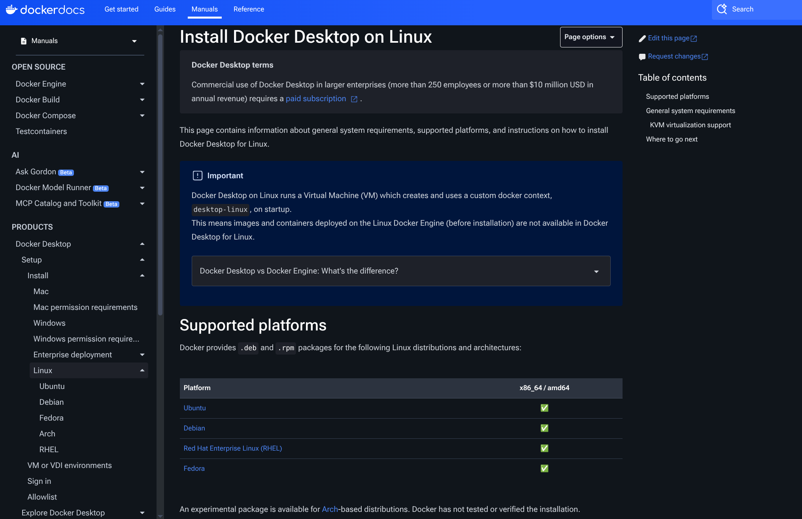

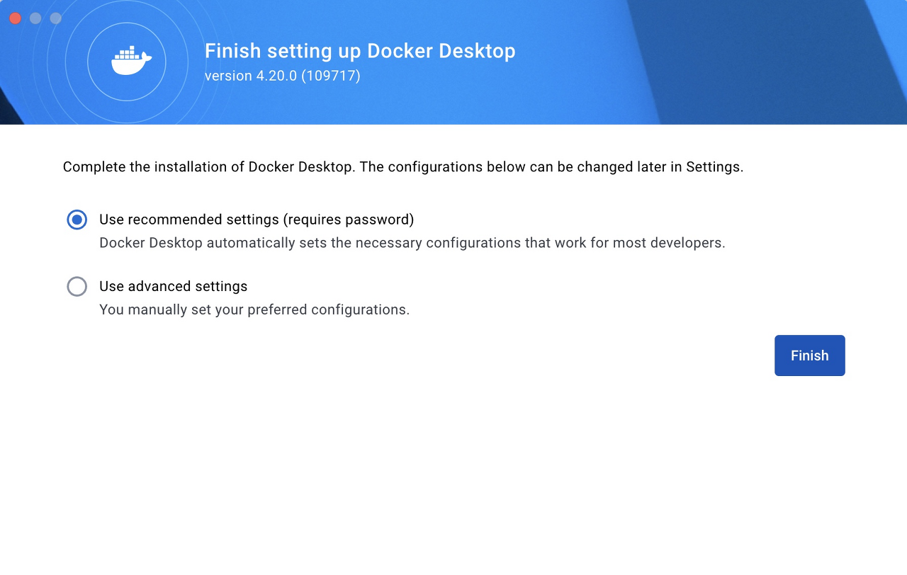
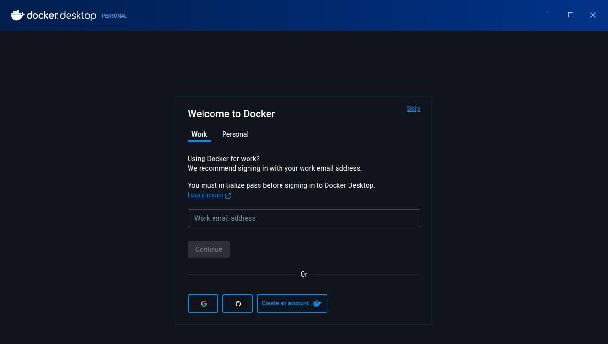
.. |image5| image:: media/getStarted/glayout/image40.png
   :width: 75%
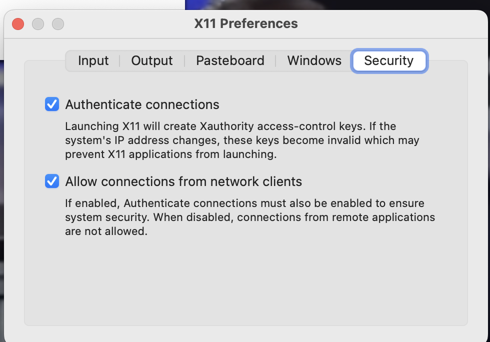
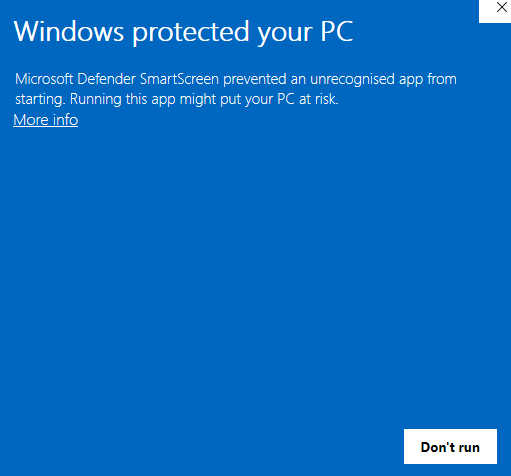
.. |image8| image:: media/getStarted/glayout/image36.png
   :width: 75%
.. |image9| image:: media/getStarted/glayout/image41.png
   :width: 75%
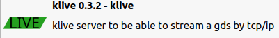

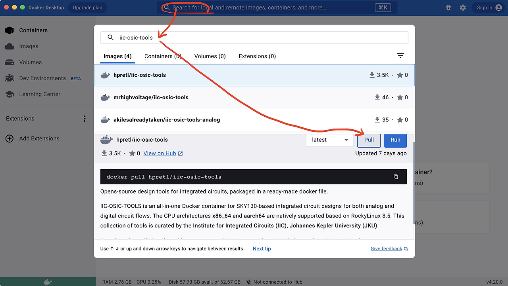
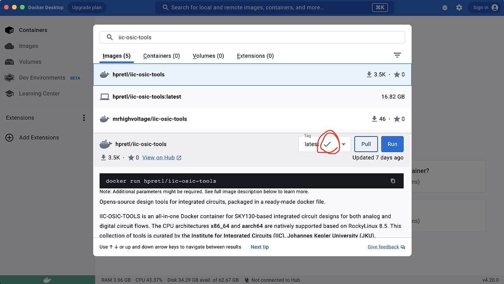

.. |image20| image:: media/getStarted/glayout/image36.png
   :width: 75%
.. |image21| image:: media/getStarted/glayout/image41.png
   :width: 75%
