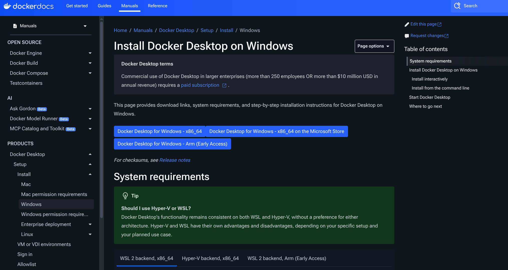
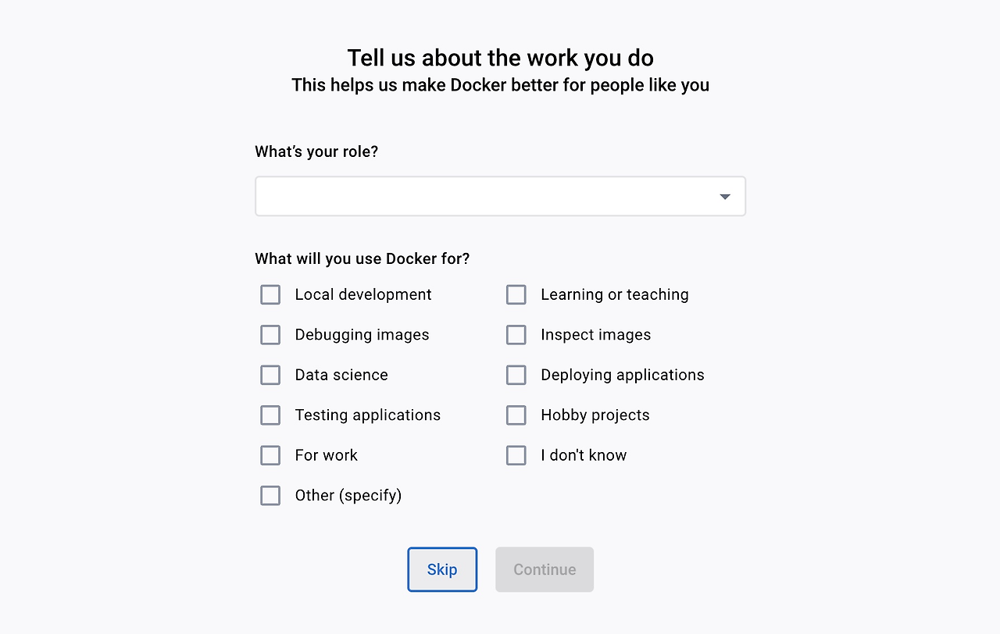
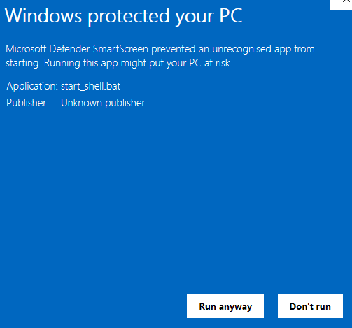
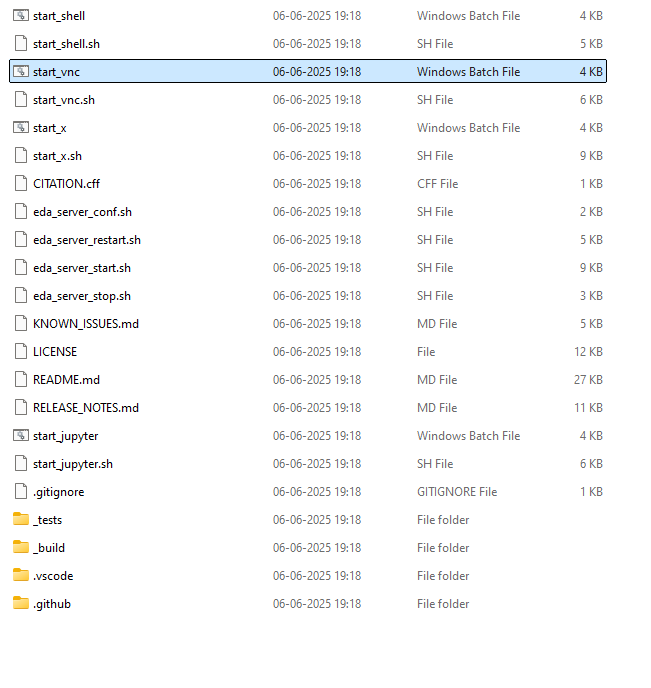

gLayout
========================

Docker Environment Setup
---------------------

This document outlines the procedure for establishing a robust
development environment for open-source design. This environment will be
provisioned within a containerised system, a sandboxed operating system
built from the
`IIC-OSIC-TOOLS <https://hub.docker.com/r/hpretl/iic-osic-tools>`__
Docker image. This approach ensures a consistent, isolated, and
reproducible workspace, minimising conflicts with your host system.

To facilitate the setup of this environment, two primary software
components must be installed on your local machine:

1. **Docker Desktop (or Docker CE):** This application provides a
      graphical user interface (GUI) for managing Docker containers and
      images. It simplifies the orchestration of containerised
      environments.

2. **Git Client:** A version control system client essential for cloning
      (downloading) open-source code repositories and associated
      scripts, primarily from platforms such as GitHub.

Key Terminologies in Docker Containerization
--------------------------------------------

To ensure a clear understanding of the architectural components, the
following key terms are defined:

-  **Docker:** Refers to the foundational platform and set of tools used
      to develop, ship, and run applications within containers. It is
      the underlying engine for containerization.

-  **Docker Desktop:** The desktop application that integrates Docker
      Engine, Docker CLI client, Docker Compose, and other
      functionalities, providing a comprehensive environment for
      managing containerised applications on a local machine.

-  **Docker Image:** A lightweight, standalone, executable package that
      includes everything needed to run a piece of software, including
      the code, a runtime, libraries, environment variables, and config
      files. In our context, the IIC-OSIC-TOOLS image serves as a frozen
      template for our development environment.

-  **Docker Container:** A runnable instance of a Docker Image. It
      represents a lightweight, portable, and isolated operating system
      environment. Multiple containers can be instantiated from a single
      Docker Image, each operating independently.

For a more comprehensive understanding of Docker, further resources are
available `here <https://docs.docker.com/>`__.

Following the installation of these prerequisite tools, we will proceed
to construct the containerised development environment. This container
will contain a comprehensive suite of tools specifically curated for
open-source design workflows, including.

-  `XSCHEM <https://xschem.sourceforge.io/stefan/index.html>`__ (Used
      for schematic capture and netlisting)

-  Open-Source `GF180
      PDK <https://gf180mcu-pdk.readthedocs.io/en/latest/>`__ , `SKY130
      PDK <https://skywater-pdk.readthedocs.io/en/main/>`__ and `IHP130
      PDK <https://ihp-open-pdk-docs.readthedocs.io/en/latest/>`__

-  Glayout (Analog Design Tool)

-  `Magic <http://opencircuitdesign.com/magic/>`__ (Used for VLSI layout
      and Extraction)

-  `Netgen <http://opencircuitdesign.com/netgen/>`__ (Used for LVS
      checking)

-  `Klayout <https://www.klayout.de/>`__ (Used for Layout,
      Visualisation, and DRC/LVS)

-  `Ngspice <https://ngspice.sourceforge.io/>`__ (Simulations )

-  `Xyce <https://xyce.sandia.gov/documentation-tutorials/>`__ (Used for
      Simulations )

-  `CACE <https://cace.readthedocs.io/en/latest/>`__, (Used for
      Automatic Circuit Characterisation)

**Install Git Client:**

Installation is platform-dependent. See `the steps
here <https://github.com/git-guides/install-git>`__

(optional) What is Git? Know more
`here <https://github.com/git-guides>`__

Why Git? We will use git to pull (or download) the open-source
codes/scripts hosted on GitHub.com. Later, we will use Git again to push
(or upload) our design contributions to the open-source repositories.

**
Install Docker Desktop:**

Docker is cross-platform and installable anywhere. Docker Desktop is the
all-in-one package to build images, run containers, and so much more. In
this step, we are going to

-  Install the Docker Desktop software

-  Pull the IIC-OSIC-TOOLS Docker image.

Docker Install
--------------

The installation process for Docker varies based on the platform you are
using. Please follow the specific instructions for your platform:

-  *Step 1:* Navigate to the Docker Desktop
      `website <https://docs.docker.com/get-started/introduction/get-docker-desktop/>`__
      and install the corresponding executables or binaries (an
      excellent guide for Windows and Mac is available
      `here <https://medium.com/@javatechie/docker-installation-steps-in-windows-mac-os-b749fdddf73a>`__)

   -  `Install Docker Desktop on
         Mac <https://docs.docker.com/desktop/setup/install/mac-install>`__

.. image:: media/image3.png
   :width: 3.25in
   :height: 1.72289in

-  `Install Docker Desktop on
      Windows <https://docs.docker.com/desktop/setup/install/windows-install>`__

-  `Install Docker Desktop for
      Linux <https://docs.docker.com/desktop/setup/install/linux/>`__
      |image1|

   -  `Install on
         Ubuntu <https://docs.docker.com/desktop/setup/install/linux/ubuntu/>`__

   -  `Install on
         Debian <https://docs.docker.com/desktop/setup/install/linux/debian/>`__

   -  `Install on Red Hat Enterprise Linux
         (RHEL) <https://docs.docker.com/desktop/setup/install/linux/rhel/>`__

   -  `Install on
         Fedora <https://docs.docker.com/desktop/setup/install/linux/fedora/>`__

   -  `Install on
         Arch <https://docs.docker.com/desktop/setup/install/linux/archlinux/>`__

-  *Step 2:* Open the Docker Desktop app and agree to the Service
      Agreement and use recommended settings

..

   |image2|\ |image3|

-  *Step 3:* Feel Free to skip the Account Creation dialogue. The skip
      option is in the top right

..

   |image4|\ |image5|

-  *Step 4:* Navigate to the
      `sscs-chipathon-2025 <https://github.com/sscs-ose/sscs-chipathon-2025>`__
      Repository and clone / download it.

..

   .. image:: media/image24.png
      :width: 10.55055in
      :height: 6.95161in

-  *Step 5:* Now, we will give security permission to Docker to interact
      with the localhost of the Host OS (your machine where Docker is
      running). This is also platform-dependent.

   -  Linux/ WSL on Windows

      -  Open a terminal and run “xhost +Local:\*”

   -  Mac

      -  Visit https://www.xquartz.org/ and download the “Quick
            Download” file

      -  Once the package is installed, run the installer

      -  Reboot your computer after XQuartz is installed

      -  Launch the XQuartz application

         -  Type in “xhost + 127.0.0.1”

..

   .. image:: media/image25.png
      :width: 4.96008in
      :height: 1.184in

-  | Go to XQuartz preferences > Security and check these options
      | ​​\ |image6|

-  *Step 6:* Now we are going to build the container from the image.

..

   The start-up scripts “start_XX.sh”(for Linux/Mac) or
   “start_XX.bat”(for Windows) use different ways to build the
   container. Follow the README at the `sscs-chipathon-2025
   repo <https://github.com/sscs-ose/sscs-chipathon-2025/blob/main/resources/IIC-OSIC-TOOLS/README.md>`__
   for details about different startup scripts.

-  **First Startup**

..

   Please note: When building for the first time, the scripts are going
   to pull the Docker image from the Docker Hub. This will take time and
   space in your storage. You should have your Docker Engine running.

   Here, we are going to focus on building the script with VNC and with
   X11 forwarding, respectively.

-  **Building with VNC**

   -  On Linux/Mac

      -  Navigate to the sscs-chipathon-2025 /resources / IIC-OSIC-TOOLS
            folder

      -  Open a terminal (or xterm) and execute “chmod +x
            ./start_chipathon_vnc.sh”

      -  Open a terminal (or xterm) and execute
            “./start_chipathon_vnc.sh”

..

   .. image:: media/image19.png
      :width: 9.51042in
      :height: 6.3125in

-  Note: this created a container named
      “iic-osic-tools_chipathon_xvnc_uid\_…” and mapped a folder
      “/home/$USER/eda/designs” to the docker (i.e. anything you
      copy/paste to this folder will be visible to the docker)

-  You can see the newly built container in the **Container** tab
      (mid-left) in the Docker Desktop Dashboard. Note the container ID.
      This will be useful later.

..

   .. image:: media/image21.png
      :width: 11.66666in
      :height: 6.7784in

-  You can now access the Desktop Environment of the OS running in the
      container through your browser
      (`http://localhost <http://localhost/>`__). The default password
      is **abc123**.

..

   .. image:: media/image18.png
      :width: 13in
      :height: 2.22988in

   .. image:: media/image17.png
      :width: 13in
      :height: 7.53467in

-  On Windows:

   -  With WSL, you can use the same steps as Linux

   -  With standard windows, you can double-click to execute
         “start_chipathon_vnc.bat” and allow permissions.

..

   |image7|\ |image8|\ |image9|

-  Then, you can open the desktop environment in your browser
      (`http://localhost <http://localhost/>`__). The default password
      is **abc123**.

-  **Building with X11**

   -  X11 forwarding allows the build container to use the Host OS’s
         display to show graphical images

   -  The Build Procedure is the same, except we will use the
         “start_x.sh” script (or “start_chipathon_x.bat” script in case
         of Windows).

   -  Note: “start_chipathon_x.sh” script *might* not work in all Linux
         Distro. See `this
         issue <https://github.com/iic-jku/IIC-OSIC-TOOLS/issues/135>`__
         at the IIC repo. The current best suggestion is to go with
         Docker CE

   -  This script should open a terminal in your native display (**not**
         through a browser window)

..

   .. image:: media/image26.png
      :width: 13in
      :height: 7.56656in

-  Now you can open graphical applications directly in your native
      display, for example: Let's try to open Klayout by typing
      “\ *Klayout&*\ ” in the terminal window

..

   .. image:: media/image22.png
      :width: 13in
      :height: 6.78423in

The difference with VNC and X11 is how Docker Container uses the
display. VNC starts a remote display protocol to show the desktop
environment of the Container OS that you can view through your browser
window, and X11 lets the container use your native display of the host.

**Note: :mark:`you can add` DESIGNS="your/path/to/directory"
./start_vnc_GL.sh :mark:`to map a user-defined directory to the Docker
Container. For details, see the JKU
`IIC-OSIC-TOOLS <https://github.com/iic-jku/IIC-OSIC-TOOLS/iss>`__
repo.`**

.. |image1| image:: media/image5.png
   :width: 3.25in
   :height: 2.0753in
.. |image2| image:: media/image30.png
   :width: 3.25in
   :height: 2in
.. |image3| image:: media/image29.png
   :width: 3.25in
   :height: 2.0625in
.. |image4| image:: media/image20.jpg
   :width: 6.5in
   :height: 3.67708in

.. |image6| image:: media/image1.png
   :width: 4.21875in
   :height: 2.06866in
.. |image7| image:: media/image28.png
   :width: 4.56646in
   :height: 4.25365in

